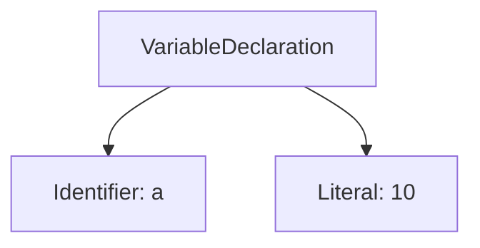
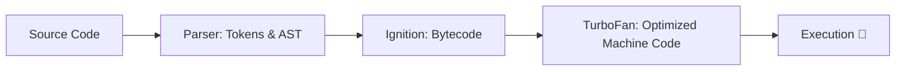

# 🧠 Deep Dive into V8 JavaScript Engine  
*Episode 08 Notes*

---

## 🎬 Behind the Scenes: Parsing Stage

When JavaScript code runs inside **V8 Engine**, it goes through multiple stages:

---

## 🔹 1. Lexical Analysis & Tokenization ✂️

- **Purpose**: Break raw JS code into **tokens** (smallest meaningful units).
- **Process**:
  ```js
  var a = 10;


➝ Tokens:

* `var` → keyword
* `a` → identifier
* `=` → operator
* `10` → literal
* `;` → punctuation

👉 **Why?** Helps the engine understand the code in manageable pieces.

---

### 🌳 Syntax Analysis → AST (Abstract Syntax Tree)

* **AST** = Tree-like structure that represents the **syntax** of code.
* Example:

  ```js
  var a = 10;
  ```



👉 You can explore ASTs here: [AST Explorer](https://astexplorer.net/)

---

## ⚡ 2. Interpreter vs Compiler

* **Interpreted Languages** (e.g., Python 🐍)
  ✅ Quick execution startup
  ❌ Slower overall (line-by-line execution)

* **Compiled Languages** (e.g., C/C++)
  ✅ Very fast execution (machine code)
  ❌ Slow initial compilation, harder debugging

🔑 **JavaScript is both!**

* Starts with **Interpreter** (fast startup)
* Uses **JIT (Just-In-Time) Compiler** to optimize hot code 🏎️

---

## 🔹 3. Inside V8: Ignition & TurboFan 🚀

* **Ignition (Interpreter)**

  * Converts AST ➝ **Bytecode**
  * Executes bytecode line-by-line

* **TurboFan (Compiler)**

  * Optimizes frequently used code (**Hot Code**)
  * Converts bytecode ➝ optimized **machine code**



---

## 🔥 4. Hot Code, Optimization & Deoptimization

* **Hot Code** = Frequently executed code

* **Optimization**

  * Inline Caching → Faster property access
  * Copy Elision → Avoids unnecessary copies

* **Deoptimization**

  * Happens if assumptions fail.
    Example: Function optimized for numbers receives strings ➝ Falls back to slower execution.

💡 **Best Practice**: Keep function inputs consistent (avoid mixing types).

---

## 📌 Key Takeaways

* V8 = **Hybrid engine** (Interpreter + JIT Compiler).
* **Ignition**: Bytecode interpreter.
* **TurboFan**: Optimizing compiler.
* Optimization boosts speed 🚀, but wrong assumptions cause deoptimization.
* Different JS engines exist (SpiderMonkey, Chakra, etc.), but **V8 is fastest** ⚡.

---

## 🌍 Resources

* 🔗 [V8 Official Website](https://v8.dev)
* 🔗 [Explore Bytecode Examples](https://github.com/v8/v8/blob/master/test/cctest/interpreter/bytecode_expectations/IfConditions.golden)

---


