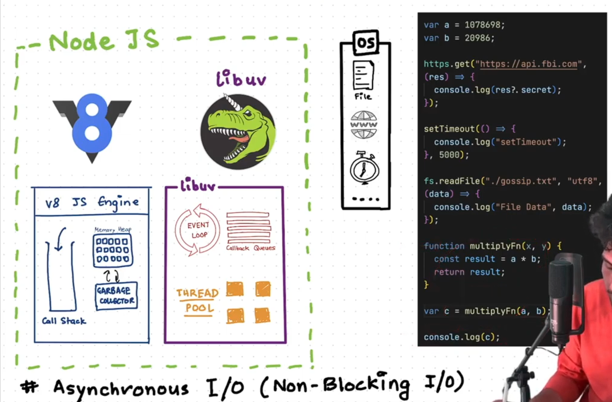
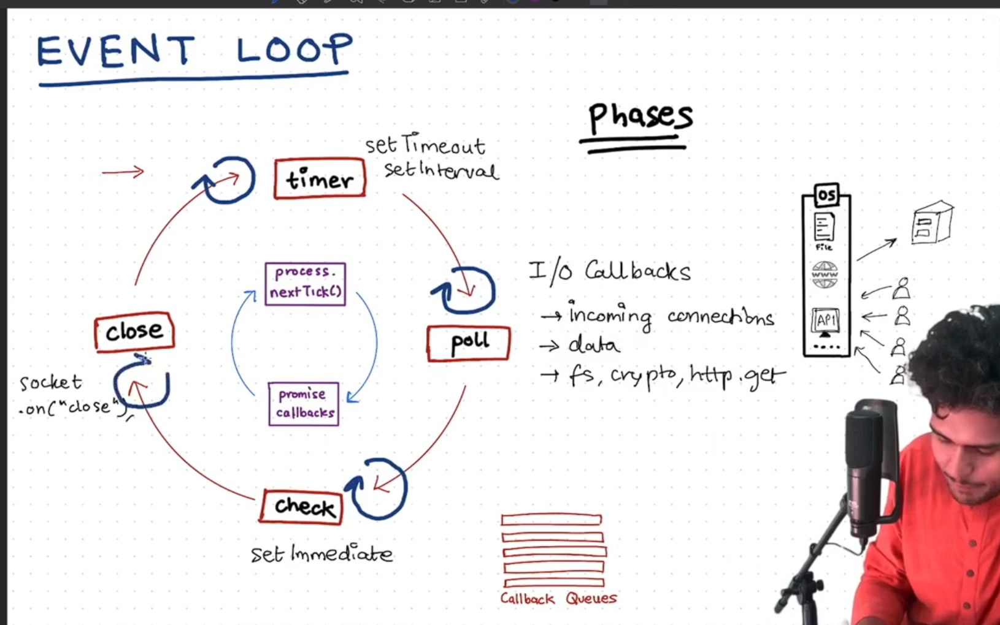
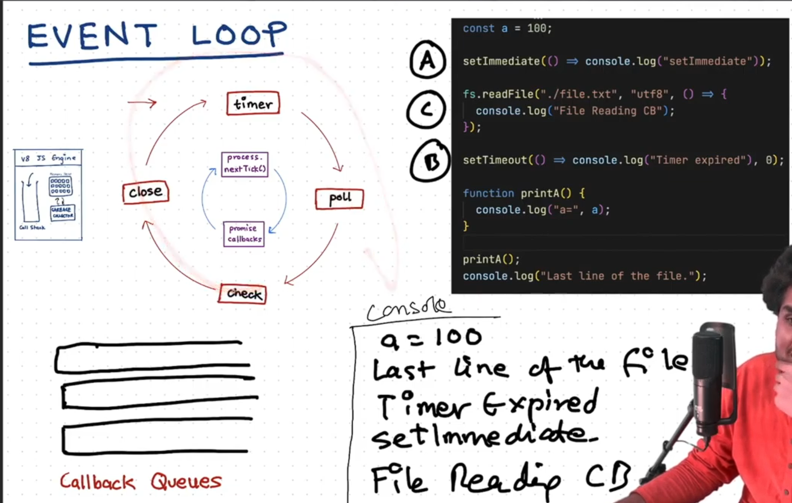

# Episode-09: Node.js Event Loop & Libuv 🚀


## 1️⃣ Libuv: The Heart of Node.js ⚡

Libuv is a crucial library in Node.js that enables:

- **Non-blocking I/O operations**
- **Event-driven architecture** through its **event loop** and **thread pool**

It handles asynchronous tasks like:  
📂 File system operations  
🌐 DNS lookups  
📡 Network requests

---

## 2️⃣ How Libuv Works ⚙️

### Components:

1. **V8 Engine 🖥️**

   - Executes your JavaScript code
   - Single-threaded → can do only one thing at a time

2. **Libuv 🔧**

   - Offloads time-consuming tasks from V8
   - Prevents blocking the main thread  
   -  Node.js runtime is responsible for offloading async operations.
   - When you call an async function (like setTimeout, fs.readFile, http.get):
    - Node.js offloads that operation to libuv.
   - libuv handles it in the background (using OS async APIs or thread pool).
   - Once finished, libuv notifies the event loop, which eventually gives control back to V8 to run your callback.

3. **Thread Pool 🧵**

   - Handles heavy tasks like file I/O or cryptography
   - Works in the background without blocking the event loop

4. **Callback Queues 📋**

   - Finished async tasks push their callbacks here
   - Separate queues for **timers**, **I/O**, **API calls**, etc.

5. **Event Loop 🔄**
   - Continuously checks if **V8 call stack** is empty
   - Moves a callback from a queue to the call stack for execution
   - Ensures proper order and timing of async operations

---

## 3️⃣ Event Loop Phases 🔄

> The event loop works in a **specific cycle**.  
> Before main phases, it always runs **microtasks** (inner cycle).

### 3.1 Microtasks (Inner Cycle) ✨

Highest priority, executed **before outer phases**:

- `process.nextTick()` callbacks ⏩ executed first
- Promise callbacks (`.then()`, `.catch()`) ⏩ executed after `nextTick`

---

### 3.2 Timers Phase ⏱️

- Handles callbacks from: `setTimeout()` & `setInterval()`
- If timer delay expired → callback added to the queue

---

### 3.3 Poll Phase 📊

- Handles **I/O callbacks**, e.g.:
  - 📂 File system operations (`fs.readFile`)
  - 🌐 Incoming network connections & data
  - 📡 API calls (`http.get`)
- If call stack empty & no tasks → waits for new events

---


### 3.4 Check Phase ✅

- Executes callbacks scheduled by `setImmediate()`
- Runs **right after poll phase** for better control of execution order

---

### 3.5 Close Callbacks Phase 🧹

- Handles cleanup tasks, e.g.:
  - `socket.on("close")`
  - Other closing operations

---



## 4️⃣ Event Loop Flow Diagram 🔁

### 🔹 Inner Cycle (Microtasks) ✨

```

process.nextTick() ➡️ Promise callbacks

```

### 🔹 Outer Cycle (Main Phases) 🌀

```

Timers ⏱️
│
▼
Poll 📊
│
▼
Check ✅
│
▼
Close 🧹

```

### 🔹 Full Flow 🔁

```

```

         ┌──────────────────────────────┐
         │      Inner Cycle (Microtasks) ✨ │
         │ process.nextTick() → Promises │
         └─────────────┬────────────────┘
                       │
                       ▼
         ┌──────────────────────────────┐
         │      Outer Cycle Phases 🌀       │
         │ Timers ⏱️ → Poll 📊 → Check ✅ → Close 🧹 │
         └──────────────────────────────┘
                       │
                       ▼
            🔄 Repeat Continuously

```

```

💡 **Tip:** Inner Cycle (microtasks) always runs **before** Outer Cycle (macrotasks).
 
---

## 5️⃣ Key Takeaways 💡

- **Libuv** enables asynchronous, non-blocking execution
- **Event Loop** has **inner** (microtasks) & **outer** (macrotasks) cycles
- **Thread Pool** handles heavy tasks without blocking main thread
- Node.js = **V8 Engine + Libuv + Event Loop + Thread Pool = Super fast async JS!** 🚀




---


# 🌐 Node.js Internals — libuv, Event Loop, Thread Pool & Callback Queue

## ⚡ libuv
- `libuv` is a **C library inside Node.js**.  
- It enables Node.js to achieve:
  - 🚀 **Non-blocking I/O**
  - 🎯 **Event-driven architecture**
- Core components of libuv:
  - 🔄 **Event Loop**
  - 🧵 **Thread Pool**
  - 📬 **Callback Queue**

---

## 🔄 Event Loop
- The **event loop** is the **orchestrator** in libuv.  
- It continuously checks:
  - ✅ If any async operations are completed.  
  - 📬 If any callbacks are waiting in the **callback queue**.  
- When the **call stack** (main thread in V8) is empty:
  - The event loop pushes callbacks into the stack for execution.  

👉 **In short:** Event loop ensures **JavaScript stays non-blocking** and executes tasks in order.  

---
## 🧵 What is Thread
- Thread is a exectuion path inside the process which allow the process to do multiple things at the same time (multitasking/concurrency/parallelism).

# Understanding Threads and Execution Paths

## 🔹 Execution Path = “Order of Steps Being Run"

When a program is running, the CPU is fetching and executing instructions one after another.
That straight line of instructions → that’s an execution path.

👉 **A thread = one straight line of execution (one flow through your code).**

---

## 🔹 Example Without Threads (1 Execution Path)

```javascript
console.log("Task 1: Read file");
// (pretend it takes 2 seconds)
console.log("Task 2: Process file");
// (pretend it takes 2 seconds)
console.log("Task 3: Save file");
```

**Explanation:**

* Only 1 thread.
* Execution path = Task 1 → Task 2 → Task 3.
* Takes \~6 seconds total.
* Nothing else can run in parallel.

---

## 🔹 Example With Threads (Multiple Execution Paths)

Imagine we spawn 3 threads:

* Thread 1 does “Read file.”
* Thread 2 does “Process file.”
* Thread 3 does “Save file.”

**Explanation:**

* The CPU scheduler can run them **at the same time** (on different cores, or interleaved on one core).
* Multiple execution paths = work gets done faster, or program feels more responsive.


## 🧵 Thread Pool
- The **thread pool** is a set of **worker threads** in libuv (default = 4).  
- Used for **time-consuming async operations**, e.g.:
  - 📂 File System I/O  
  - 🌐 DNS lookups  
  - 🔐 Crypto operations  
- These heavy tasks are offloaded to the thread pool instead of blocking the main thread.  
- Once completed, results are sent back to the **callback queue** for execution via the event loop. 

### 🔹 Key Points
- These 4 threads are software threads
- They run on your CPU’s hardware threads (like your 16-thread Ryzen CPU).
- Because tasks are done in the background by libuv threads, the main thread stays free → non-blocking I/O.

👉 **Analogy:** Like extra cooks 👨‍🍳👩‍🍳 helping the main chef (V8) in the kitchen.  

---

## 📬 Callback Queue
- The **callback queue** stores callbacks waiting to be executed.  
- When async tasks (done by thread pool or OS) are finished:
  - Their callbacks are placed here.  
- The event loop checks this queue and pushes them into the call stack when ready.  

---

## 🎯 Final Interview-Ready Answer
**“libuv is a C library that powers Node.js’s non-blocking, event-driven model.  
It provides the event loop to manage callbacks, a thread pool for heavy async tasks, and a callback queue to schedule execution back into the JavaScript main thread (V8).”**

