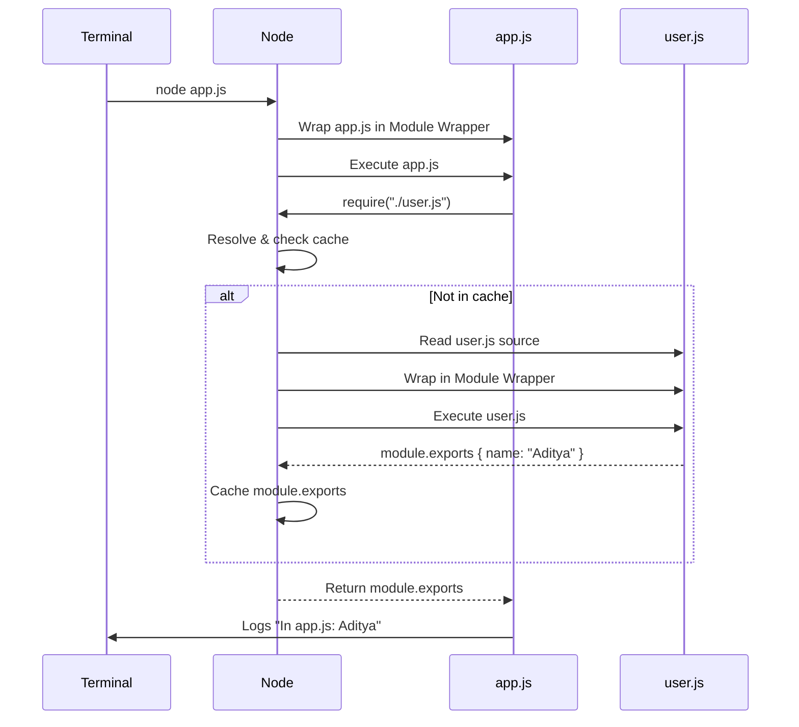

# 📦 Node.js Modules

## 🔹 What is a Module?
A **module** in Node.js is a **reusable block of code** (usually a single JavaScript file or package) that does a specific job.  

- By default, all code inside a module is **private**.  
- To share functionality, we must **export** it.  
- Other files can then **import** it using `require()` or `import`.  

---

## 🔹 Why use Modules?
✅ **Organization** → keeps code clean and structured.  
✅ **Reusability** → write once, use in multiple files/projects.  
✅ **Encapsulation** → hides internal details, exposes only what’s needed.  

---

## 🔹 Types of Modules in Node.js

1. **🛠️ Core Modules**  
   Built into Node.js (no installation needed).  
   Examples: `fs`, `http`, `path`.  

2. **📂 Local Modules**  
   Created by you, saved as files in your project.  
   Example: `math.js` with custom functions.  

3. **📦 Third-party Modules**  
   Installed via **npm (Node Package Manager)**.  
   Example: `express`, `lodash`, `mongoose`.  

---

## 🔹 Example

**math.js (local module):**
```js
// private function (not exported)
function multiply(a, b) {
  return a * b;
}

// exported function
function add(a, b) {
  return a + b;
}

// make add available outside this file
module.exports = { add };
````

**main.js:**

```js
const math = require("./math.js");

console.log(math.add(2, 3));   // ✅ 5
console.log(math.multiply);    // ❌ undefined (not exported)
```

---

✨ **Summary:**
A **module** is a way to split your code into smaller, reusable, and maintainable chunks.
Only the parts you **explicitly export** can be accessed from other files.


# 📦 Node.js `require()` and `module.exports` Explained

When we use `require()` and `module.exports` in Node.js, we are actually using the **CommonJS module system**.  
Let’s see how it works **behind the scenes**.

---

## 🚀 1. Module Wrapper Function
Every file in Node.js is wrapped inside a hidden function before execution:

```js
(function (exports, require, module, __filename, __dirname) {
    // Your file code here
});
````

This provides:

* `exports`
* `require`
* `module`
* `__filename`
* `__dirname`

---

## 📂 2. Entry File Execution (`app.js`)

When we run:

```bash
node app.js
```

1. Node reads `app.js`.
2. Wraps it inside the **Module Wrapper**.
3. Executes it immediately.

---

## 🔄 3. How `require("./user.js")` Works

When `app.js` calls:

```js
const user = require("./user.js");
```

Node does the following:

1. **Resolve path** → find `./user.js`.
2. **Check cache** → if already loaded, return cached `module.exports`.
3. **If not cached**:

   * Read source of `user.js`.
   * Wrap in Module Wrapper.
   * Execute the wrapper.
   * Store the `module.exports` object in cache.
4. **Return** → `module.exports` from `user.js` back to `app.js`.

---

## 🧩 4. Example Flow

**user.js**

```js
console.log("user.js running");

module.exports = { name: "Aditya" };
```

**app.js**

```js
const user = require("./user.js");
console.log("In app.js:", user.name);
```

**Terminal Output**

```
user.js running
In app.js: Aditya
```

---

## 🎯 5. Mermaid Diagram of Flow



---

## 📝 Key Takeaways

* ✅ `app.js` (entry file) → wrapped immediately when Node starts.
* ✅ Other modules (`user.js`) → wrapped **only when first required**.
* ✅ `require()` → resolve → check cache → wrap & execute (if new) → return `module.exports`.
* ✅ Each file gets its **own scope** with `exports`, `require`, and `module`.

---

✨ That’s how Node.js powers `require()` and `module.exports` under the hood!


