---

# 📚 Namaste Node.js – Episode 12: Databases

---

## 🗄️ What is a Database?

A **Database** is an **electronic organized collection of data** stored in a structured way using a **Database Management System (DBMS)**.

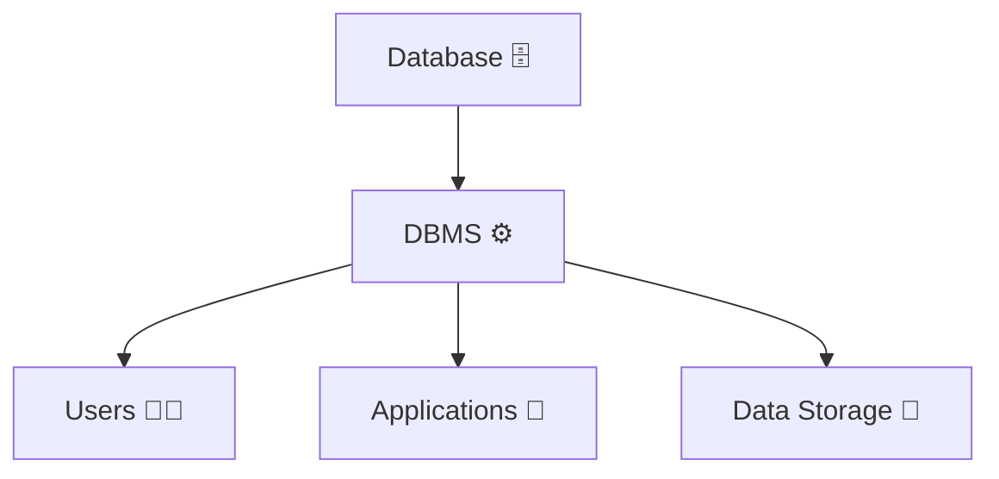

---

## ⚙️ What is DBMS?

A **Database Management System (DBMS)** is software that:

* Interacts with the **user** and the **database**
* Provides tools to **store, modify, retrieve, and manage** data
* Ensures data consistency, security, and availability

---

## 🏛️ Types of Databases
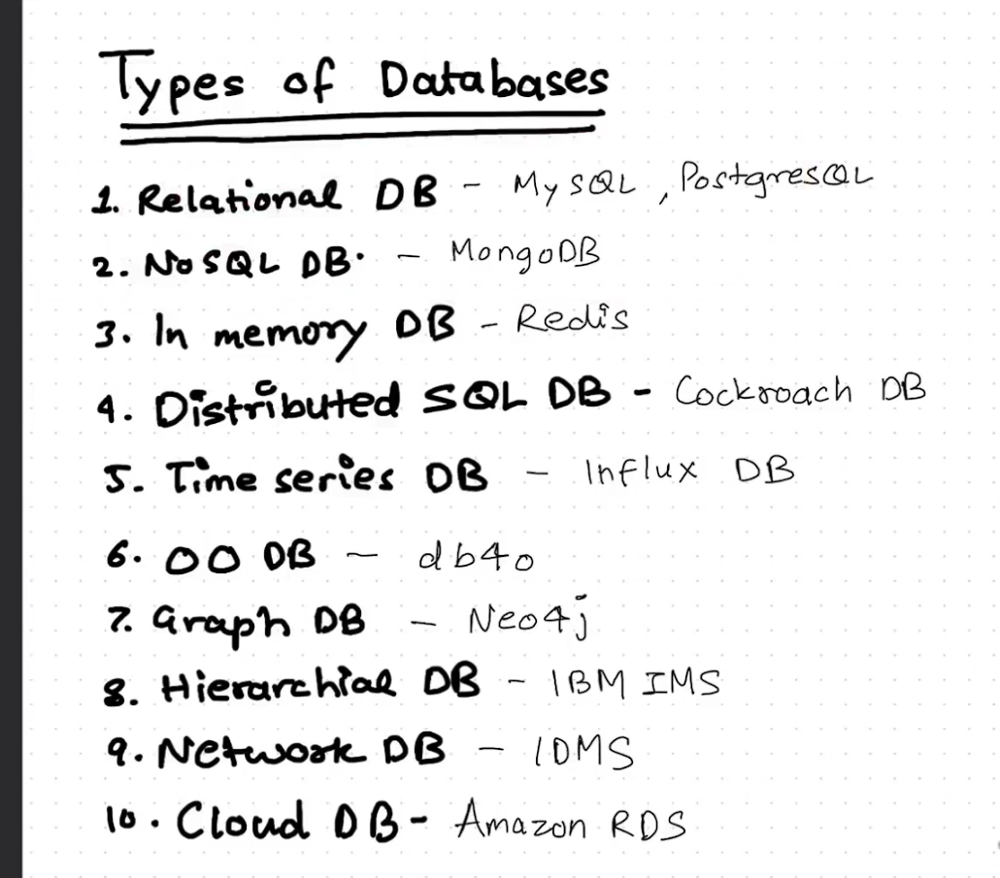


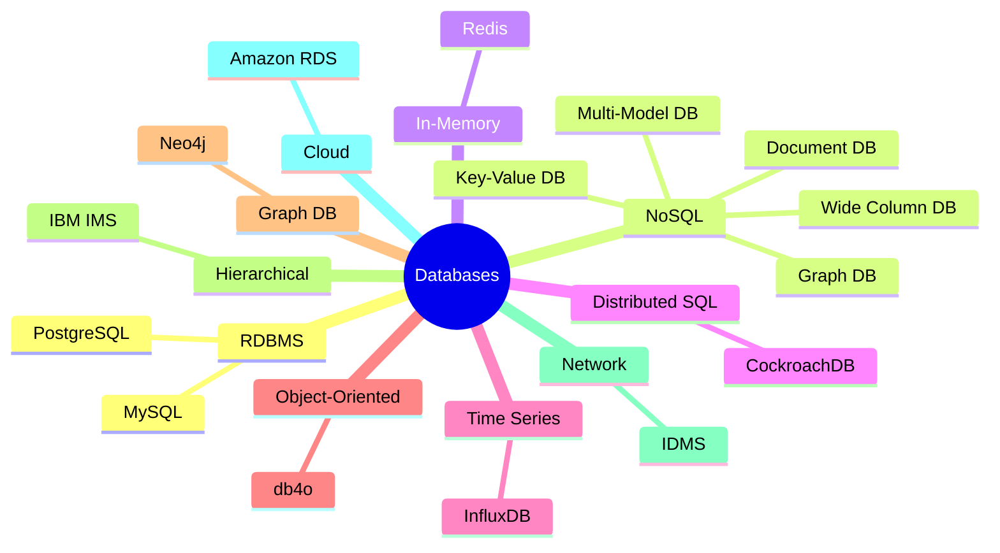

---

## 🧑‍🏫 RDBMS (Relational Databases)
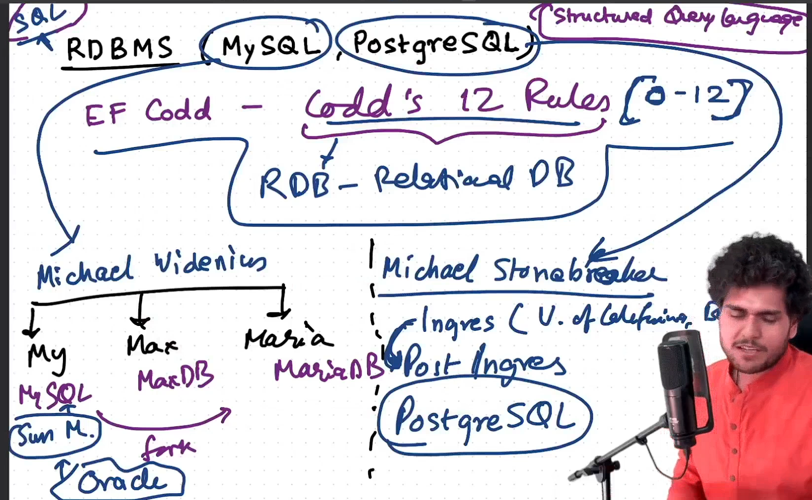

* 💡 **E.F. Codd** gave **Codd's 12 Rules (0–12)** → defines if a database is truly relational
* ✅ Examples: **MySQL, PostgreSQL**
* 🧑‍💻 **Michael Widenius** → Creator of MySQL

  * MySQL → Acquired by Sun Microsystems → Later acquired by Oracle
* 📜 **SQL (Structured Query Language)** → Used to query relational databases

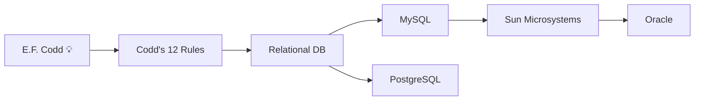

---

## 🌐 NoSQL (Not Only SQL)
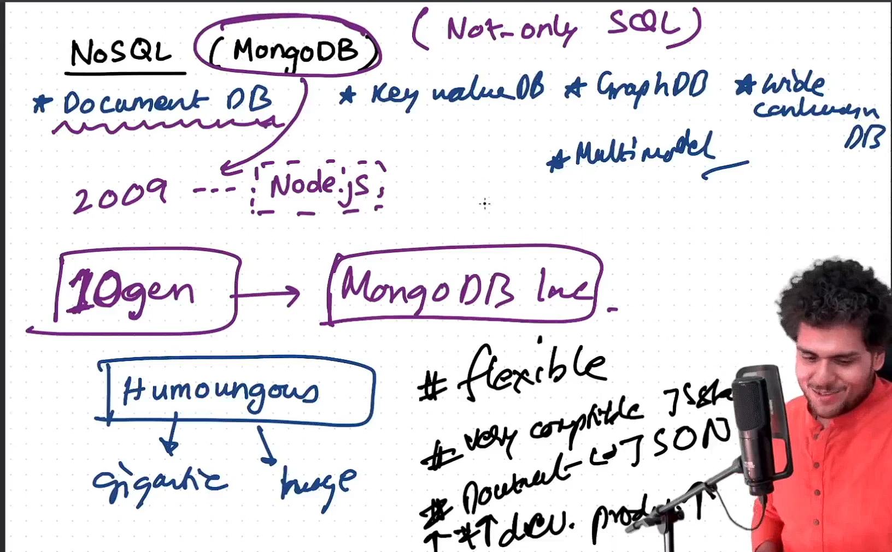


🔹 **Types of NoSQL Databases**:

* 📄 Document DB (MongoDB)
* 🔑 Key-Value DB (Redis)
* 🌐 Graph DB (Neo4j)
* 📊 Wide Column DB (Cassandra, HBase)
* 🔀 Multi-Model DB

### 🟢 MongoDB Highlights

* 🚀 Released in **2009** (same time as Node.js – they work great together 💚)
* 🏢 Created by **10gen** → later renamed **MongoDB Inc.**
* 🏗️ Name comes from **Humongous** (Huge, Gigantic)
* ⚡ Features:

  * Flexible (schema-less)
  * Stores data as **Documents (JSON-like)**
  * Perfectly fits with **JavaScript/Node.js**
  * Improves developer productivity
* 🔧 Built with **C++, JavaScript, Python, Java**

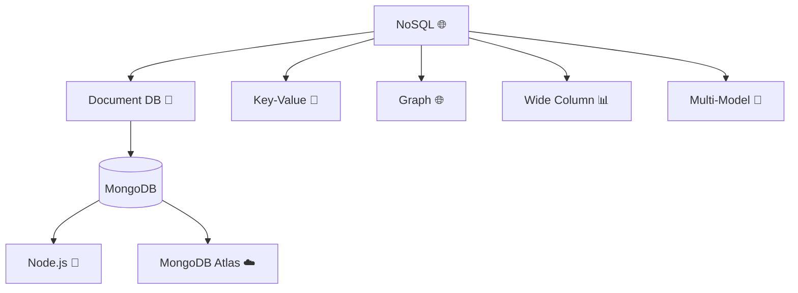

---

## 🔄 RDBMS vs NoSQL

### 📊 Structure Comparison
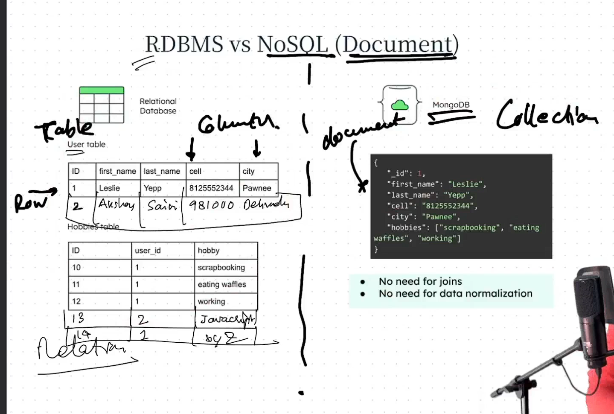


---

### 🆚 Feature Comparison
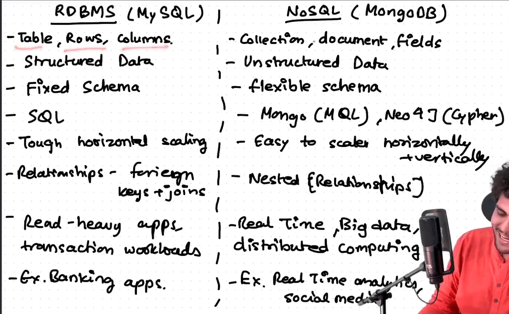


| Feature        | **RDBMS (MySQL)** 🏛️                | **NoSQL (MongoDB)** 🌐                      |
| -------------- | ------------------------------------ | ------------------------------------------- |
| Storage        | Tables, Rows, Columns                | Collections, Documents, Fields              |
| Data Type      | Structured                           | Semi/Unstructured                           |
| Schema         | Fixed                                | Flexible                                    |
| Query Language | SQL                                  | MQL (Mongo Query Language)                  |
| Scaling        | Hard (vertical scaling)              | Easy (horizontal scaling)                   |
| Relationships  | Foreign Keys + Joins                 | Nested / Embedded                           |
| Use Case       | Banking, ERP, Transaction-heavy apps | Big Data, Real-time analytics, Social media |

---

## ☁️ MongoDB in Node.js

You can use MongoDB in **two ways**:

1. **Local Setup** → Download and run MongoDB on your system
2. **Cloud Setup** → Use **MongoDB Atlas** (cloud-hosted, free tier available 🎉)

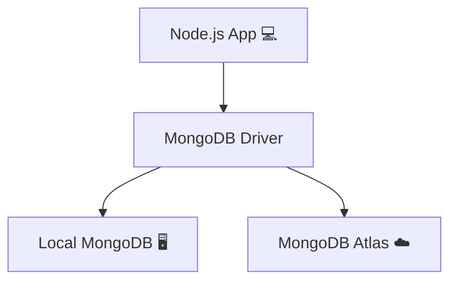

---

## 📝 Summary

* **Database** → Organized data storage
* **DBMS** → Software to manage databases
* **RDBMS** → Uses tables, SQL, structured data
* **NoSQL** → Flexible, JSON-like, scalable
* **MongoDB** → Popular NoSQL DB, great with Node.js

---

✨ Stickers & Emojis Legend:

* 🏛️ = Traditional / Structured
* 🌐 = NoSQL / Modern
* 📊 = Data representation
* 🚀 = Performance / New tech
* 💡 = Key Concept
* ☁️ = Cloud

---


# 📚 Namaste Node.js – Episode 13: MongoDB with Node.js

---

## 🌐 Getting Started with MongoDB

1. 🔑 **Sign in** to the [MongoDB Website](https://www.mongodb.com/)
   

2. ☁️ **Create a Cluster** on MongoDB Atlas
   

3. 🔗 **Get the Connection String** for Compass
   

4. 💻 **Install Tools**:

   * MongoDB Compass (GUI) 🖥️
   * MongoDB Shell (CLI) ⌨️

---

## 🏗️ Creating Your First Database

👉 Open **MongoDB Compass** and:

* Create a **Database**
* Inside it → create a **Collection**
* Insert your **first Document** 📄


```json
{
  "name": "Akshay",
  "course": "Node.js",
  "episode": 13
}
```

---

## 🔌 Connecting MongoDB with Node.js

1. 📦 Install MongoDB Driver

```bash
npm install mongodb
```

👉 [MongoDB Driver Reference (NPM)](https://www.npmjs.com/package/mongodb)

2. 📑 Use the **official documentation** to set up connection

```js
// index.js
const { MongoClient } = require("mongodb");

const uri = "your-mongodb-connection-string-here";
const client = new MongoClient(uri);

async function run() {
  try {
    await client.connect();
    console.log("✅ Connected to MongoDB");

    const db = client.db("namasteNode");
    const collection = db.collection("students");

    // Insert a document
    await collection.insertOne({ name: "Akshay", episode: 13 });

    // Fetch documents
    const result = await collection.findOne({ name: "Akshay" });
    console.log("Fetched Document:", result);
  } finally {
    await client.close();
  }
}

run().catch(console.dir);
```

---

## ⚡ CRUD Operations with MongoDB Driver


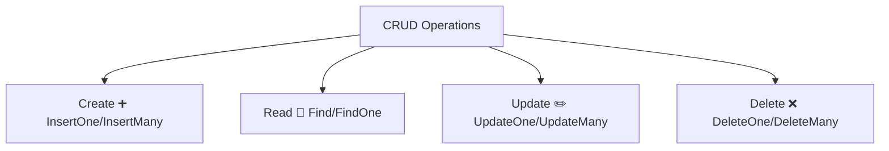

* **Create** → `insertOne()` / `insertMany()`
* **Read** → `findOne()` / `find()`
* **Update** → `updateOne()` / `updateMany()`
* **Delete** → `deleteOne()` / `deleteMany()`

---

## 🧑‍💻 Today’s Learning

✔️ Learned to use the **MongoDB driver** in Node.js
✔️ Performed **CRUD operations**
✔️ Understood the difference between **Compass GUI** and **Code-based connection**
✔️ Next step → Explore **Mongoose ODM library** 🦆

---

## 📖 MongoDB vs Mongoose


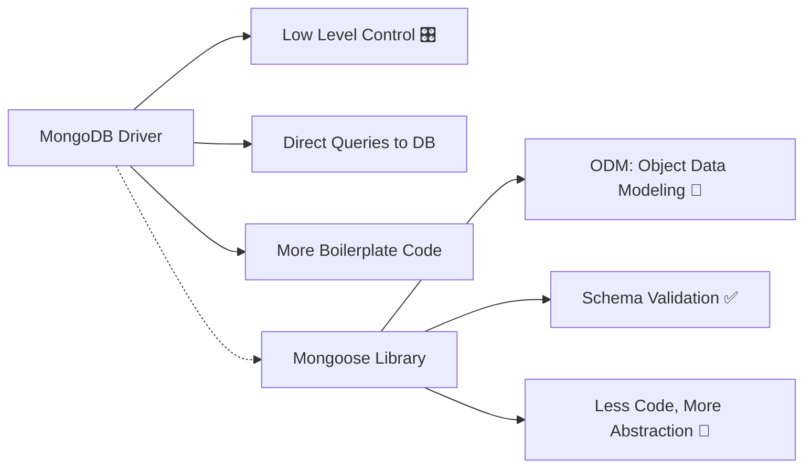

| Feature        | **MongoDB Driver**                | **Mongoose**                 |
| -------------- | --------------------------------- | ---------------------------- |
| Level          | Low-level API                     | High-level ODM               |
| Schema         | Flexible                          | Schema enforced              |
| Learning Curve | Easier to start                   | Slightly more concepts       |
| Use Case       | Small scripts, direct DB handling | Scalable apps, strict models |

---

## 📝 Summary

* Signed into **MongoDB Atlas** & created cluster
* Connected using **Compass** & **MongoDB Shell**
* Installed & used the **MongoDB Driver** (`npm install mongodb`)
* Performed **CRUD operations**
* Next: Learn **Mongoose** for schema-based modeling

---

✨ Stickers & Emojis Legend:

* ☁️ = Cloud
* 📦 = Package
* 🧑‍💻 = Developer tasks
* 📄 = Document
* ⚡ = Fast operation
* 🧩 = Abstraction/Schema

---

