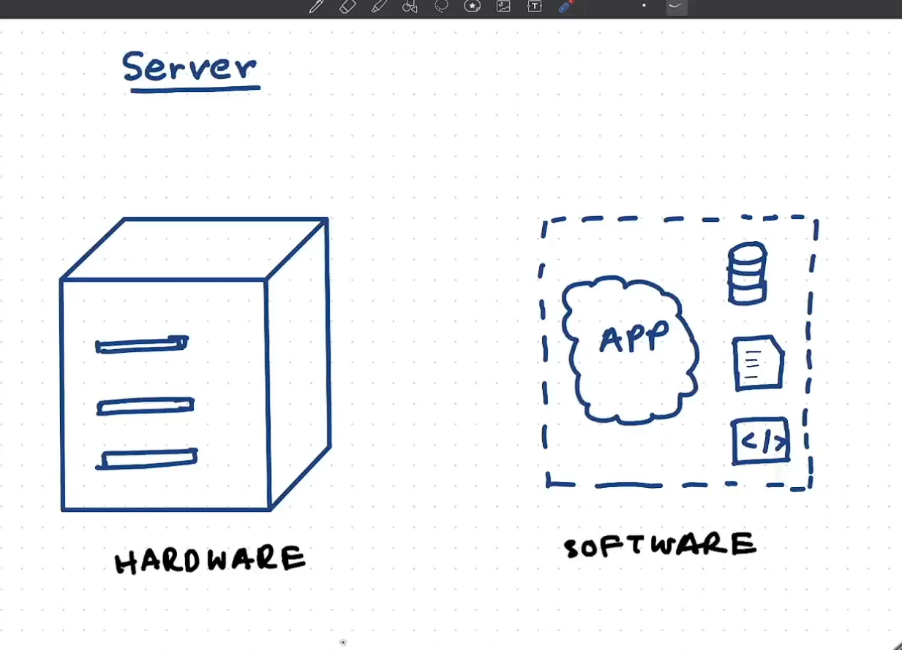
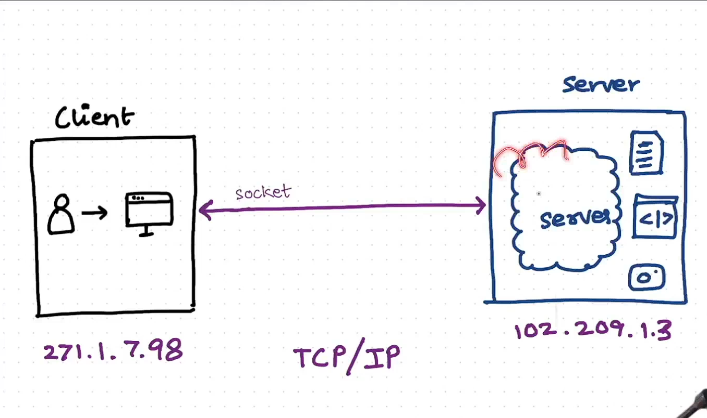
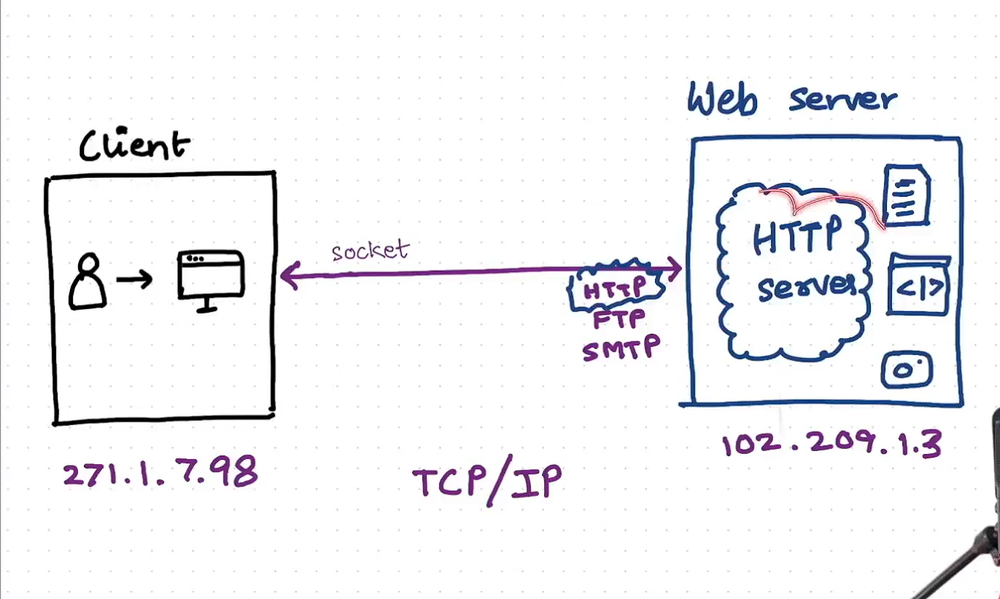
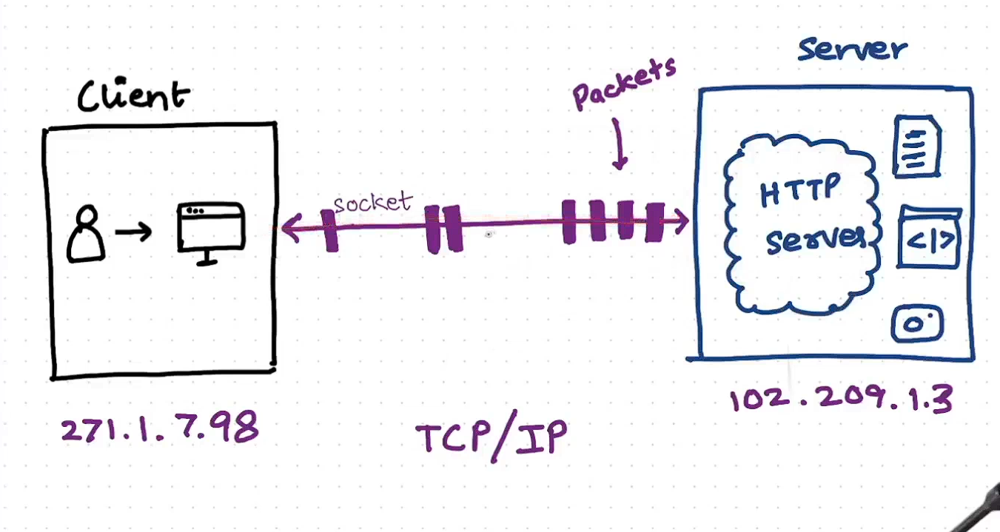
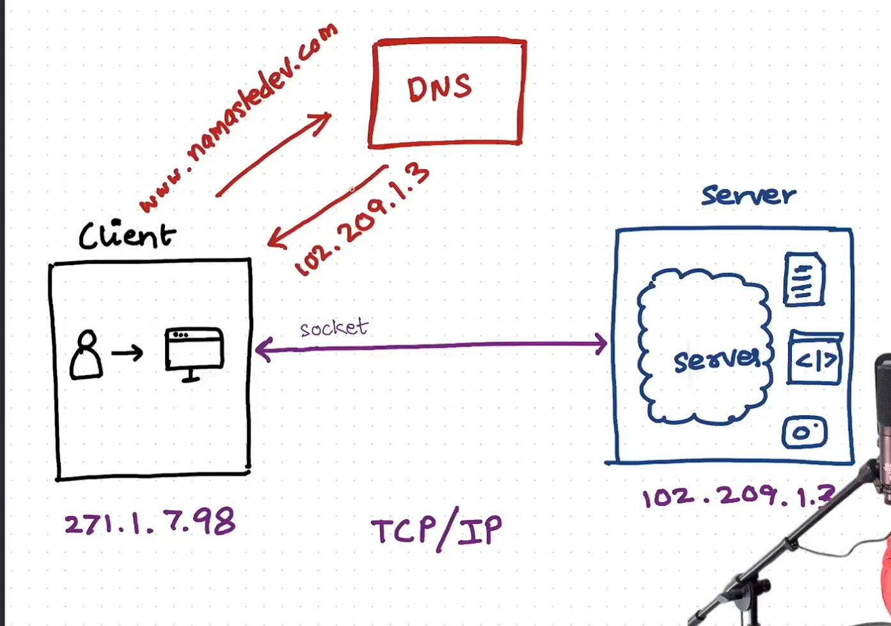
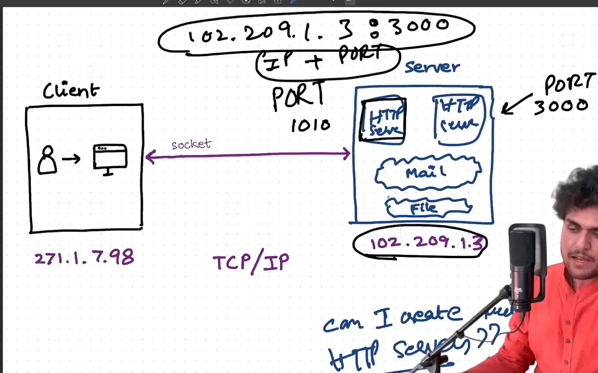
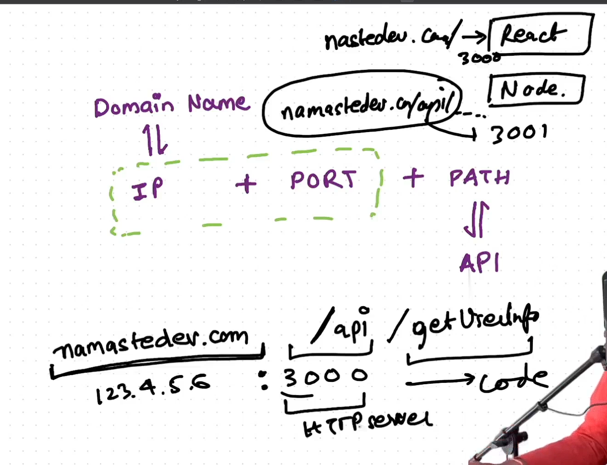
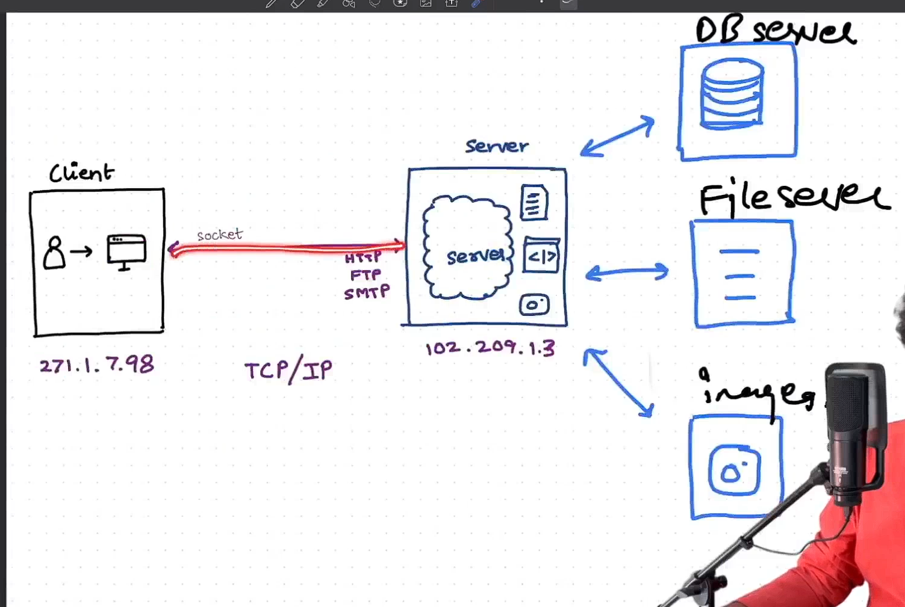

---

# 📘 Node.js Lecture 11 – Servers & Client-Server Architecture 🚀

---

## 🖥️ What is a Server?

A **Server** is simply a computer (or program) that provides services/data to other computers (called **Clients**) over a network.

It has **two parts**:

### ⚡ Hardware Server

* The **physical machine** that contains:

  * CPU 🧠
  * Memory (RAM) 💾
  * Storage (Hard Disk) 📂
* If using cloud providers like AWS ☁️ → you can **increase CPU/RAM** as needed.

### 🛠️ Software Server

* The **software part** running on the hardware.
* Responsible for:

  * Handling client requests 📡
  * Processing them ⚙️
  * Sending back responses 📬

👉 Example: An **HTTP Server** serves web pages, APIs, JSON, etc.

📌 Diagram:
 

---

## 🌐 Client-Server Architecture

Whenever a **Client** sends a request to the **Server**:

1. A **Socket connection** 🔗 is created.
2. The **Server listens** 👂 to the request.
3. The Server **processes & sends response** back.
4. The socket connection is **closed** (for normal sockets).

# 🌐 Client–Server Architecture (Simple View)

## 👩‍💻 Client
- 🖥️ (or 📱 mobile app)  
- Makes a request (e.g., *“give me data”*, *“send this message”*).

## 🖥️ Server
- Always **listens 👂** on a socket (IP + port).  
- Processes the client’s request.  
- Sends back the response.  

## 🔗 Socket Connection
- Created when the client contacts the server.  
- Used to transfer **requests & responses**.  
- Closed when communication ends (for normal request–response sockets).  

---

## 👉 Key Point
- It’s not *only* about sockets — the main idea is the **division of roles**:  
  - **Client** = requester / consumer.  
  - **Server** = responder / provider.  
- **Sockets** are just one implementation detail of how the data actually flows.  

📌 Diagram:
 [Client-Server Architecture](notes.md)

### ✨ Key Points:

* Both Client & Server have their own **unique IP Address** 🌍
* Internet is called a **WEB 🕸️** because all computers (nodes) are interconnected via IPs.
* Communication happens through **sockets** which use **TCP/IP protocol**.

---

## 📡 Protocols

* **TCP/IP** → Handles **transmission** of data in small chunks called **packets** 📦
* **HTTP (HyperText Transfer Protocol)** → For web pages, HTML, JSON, APIs 🌐
* **FTP (File Transfer Protocol)** → For file transfer 📂
* **SMTP (Simple Mail Transfer Protocol)** → For emails 📧

👉 Think of **HTTP, FTP, SMTP as languages** 🗣️ that define **format of data**
👉 And **TCP/IP as the delivery system 🚚** that actually sends data packets

📌 Diagram:


---

## 📦 Data Transmission

* Server doesn’t send the **entire file at once** ❌
* Data is broken into **packets** 📦 and sent through the socket connection.
* Client **reassembles packets** 🧩 to get the full data.

📌 Diagram:


💡 **Buffering**: Packets are stored in a **buffer 🛑** before being played (like when a video is loading).

---

## 🌍 DNS (Domain Name System)

* Humans remember **domain names** (like `namastedev.com`) 🧑‍💻
* Computers need **IP addresses** (like `102.209.1.3`) 🔢
* DNS is like a **phonebook 📖** that maps domain name → IP.

📌 Diagram:


---

## 🔢 IP Address + Port

* A **Server machine** has **one IP** (e.g., `102.209.1.3`) 🌍
* But inside it, you can run **multiple servers** (HTTP, FTP, Mail, etc.)
* To differentiate them → we use **Port Numbers** 🔢

👉 Example:

```
102.209.1.3:3000 → HTTP Server (API)  
102.209.1.3:3001 → Another HTTP Server  
```

📌 Diagram:



---

## 🔗 URL Structure (Uniform Resource Locator)

A URL is made of:

```
Domain Name → IP  
IP + Port + Path → Full Address
```

👉 Example:

* `namastedev.com` → mapped to `123.4.5.6`
* `namastedev.com:3000` → React App
* `namastedev.com/api/profile` → Node.js API

📌 Diagram:


---

## 🗄️ Multiple Servers

As projects grow → companies don’t keep everything on one machine.
They use **different servers** for:

* Database Server 🗄️
* File Server 📂
* Image Server 🖼️
* Mail Server 📧

📌 Diagram:


---

## 🔌 Socket vs WebSocket

### 🔗 Socket (Normal)

* Created by **Client** for each request
* Closed ❌ after response is received
* **One-way communication** → Client asks, Server responds

### 🌐 WebSocket

* **Persistent connection** (doesn’t close) 🔄
* Created by **Server**
* **Two-way communication** ↔️ (Client ↔️ Server anytime)
* Uses more memory ⚠️ → since server must hold open sockets

👉 Normal websites use **basic sockets**
👉 WebSockets are used for **real-time apps** (Chats 💬, Live Games 🎮, Stock updates 📊)

---

# 🎯 Key Takeaways

* Server = **Hardware + Software** 🖥️
* Communication happens via **Sockets** using **TCP/IP** 📡
* Protocols like **HTTP, FTP, SMTP** define **data format**
* Data is always sent in **packets** 📦
* **DNS** maps domain → IP 🌍
* **Ports** help run multiple servers on one IP 🔢
* WebSocket = Persistent, two-way socket 🔄

---


# 🧩 How Data Travels (Backend Dev View)

## 1. **🔑 Socket = Doorway**
- A **socket** is like a doorway for your app to talk to the network.  
- Defined as: `IP + Port + Protocol (TCP/UDP)`  
- Example:  
  - 📱 WhatsApp server: `192.168.1.5:443 (TCP)`  
  - 📲 Your phone: `10.0.0.7:53214 (TCP)`  

---

## 2. **🙋 Who creates sockets?**
- **Client (you)** 🧑‍💻 opens a socket connection.  
- **Server** 🖥️ is always listening on its socket.  
- Together → they form a connection (📞 like a phone call).  

---

## 3. **📬 How the message flows**
1. ✍️ App (WhatsApp) → gives your text to **socket**.  
2. 🖥️ Socket hands it to your **OS networking stack**.  
3. 📦 OS packages it into **TCP/IP packets**.  
4. 📡 Packets leave your phone using **radio signals** (4G/5G/Wi-Fi).  
5. 🌐 Signal travels through towers/routers until it reaches the **server socket**.  
6. 📥 Server reads the message → sends it forward (to your friend).  

---

## 4. **🔗 What’s between sockets?**
- Not a physical pipe 🛠️  
- Just a **virtual connection** managed by **TCP/IP**.  
- Physically = **radio waves** (4G/5G/Wi-Fi) → then wires/fiber (**electricity/light**).  

---

## 5. **🪄 Analogy (Easy to Remember)**
- **Client socket** = you dialing a number 📞  
- **Server socket** = someone picking up ☎️  
- **TCP/IP** = ensures your words don’t get scrambled 📜  
- **Radio signals** = the air carrying your voice 🌬️  

---

## 📊 Diagram: WhatsApp Message Journey

```mermaid
sequenceDiagram
    participant You as 📱 Your Phone (Socket)
    participant Radio as 📡 Radio Waves (4G/5G/Wi-Fi)
    participant Net as 🌐 Internet Routers
    participant Server as 🖥️ WhatsApp Server (Socket)
    participant Friend as 📱 Friend's Phone (Socket)

    You->>Radio: "Hello 👋" (text → TCP/IP packets)
    Radio->>Net: Packets modulated into radio signals
    Net->>Server: forwards packets via routers/fiber
    Server->>Net: sends to recipient
    Net->>Radio: packets → converted back to radio waves
    Radio->>Friend: "Hello 👋" appears in chat
````
---
---

# simple socket 

```mermaid
flowchart TD
    A[👨‍💻 Client Program] 
    B[🔌 Client Socket]
    C[🌐 TCP/IP Layer]
    D[🌐 TCP/IP Layer on Server]
    E[🔌 Server Socket]
    F[🖥️ Server Program]

    A -->|📝 HTTP Request| B
    B -->|📦 Raw Bytes| C
    C -->|🚚 Packets Travel| D
    D -->|📦 Bytes Delivered| E
    E -->|📖 HTTP Parser Reads| F

    F -->|📝 HTTP Response| E
    E -->|📦 Raw Bytes| D
    D -->|🚚 Packets Travel| C
    C -->|📦 Bytes Delivered| B
    B -->|📖 HTTP Parser Reads Response| A

    classDef client fill:#0000,stroke:#0a66c2,stroke-width:2px;
    classDef server fill:#0000,stroke:#ff6700,stroke-width:2px;

    class A,B,C client;
    class D,E,F server;
```

---

### **Explanation of the vertical stack**

1. **Top → Bottom** = Request flow.
2. **Bottom → Top** = Response flow.
3. Each layer shows its **role** with an emoji:

   * 🔌 Socket = connection
   * 🌐 TCP/IP = packet delivery
   * 📝 HTTP = message format

---


