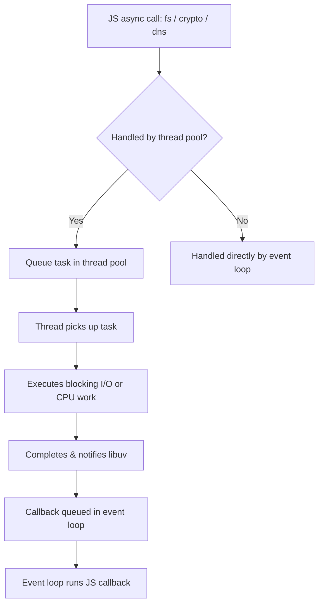
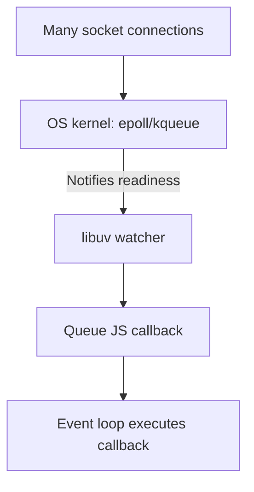

# 🎬 Episode 10 — Thread Pool in libuv

✨ *Beautiful, structured notes with stickers, corrected Mermaid diagrams, and runnable code examples*  

---

## 🧵 Quick Summary

Node.js is *single-threaded* for synchronous JS code, but for many asynchronous operations, **V8** delegates work to **libuv**, which:  
- Uses a **thread pool** (default size: `4`) for blocking tasks  
- Leverages OS-level mechanisms (`epoll` on Linux, `kqueue` on macOS) for networking  

---

## 📑 Table of Contents

1. 🎯 What is the libuv thread pool?  
2. 🔁 When libuv uses the thread pool  
3. 🛠️ Default size and how to change it  
4. 🧩 Example flows & code snippets  
5. ⚡ Networking: epoll / kqueue & file descriptors  
6. 📦 Other Node.js building blocks  
7. 🌈 Mermaid diagrams (visual workflows)  
8. ✅ Practical code examples  
9. 📝 Tips & gotchas  
10. 🎉 Stickerboard  
11. 🏁 TL;DR  

---

## 1. 🎯 What is the libuv thread pool?

- Certain asynchronous tasks (e.g., filesystem, DNS, crypto) are **offloaded** from the JS main thread to libuv’s **thread pool**.  
- Each thread runs one task at a time; busy threads can’t process new tasks until they finish.  

---

## 2. 🔁 When does libuv use the thread pool?

✅ Uses the pool for:  
- File system (`fs`) operations  
- DNS lookups (blocking ones)  
- Crypto functions (e.g., `pbkdf2`)  

❌ Does *not* use the pool for:  
- Networking (handled by epoll/kqueue)  

👉 **Answer to classic question**:  
Node.js is *single-threaded* for JS, but *multi-threaded under the hood* via libuv’s thread pool.  

---

## 3. 🛠️ Default size and how to change it

- Default size: **`4`** (`UV_THREADPOOL_SIZE=4`)  
- Increase with an environment variable before running Node:  

```bash
# Example: set to 8 threads
export UV_THREADPOOL_SIZE=8
node app.js
```

⚠️ You *can* change it inside code (before requiring modules), but it’s best set via env vars:  

```bash
process.env.UV_THREADPOOL_SIZE="8";
```

---

## 4. 🧩 Thread-pool execution behaviour

Imagine **5 simultaneous file reads** with pool size = `4`:  
- 4 threads are immediately busy  
- 1 operation waits in queue  
- **Order of completion is NOT guaranteed**  

---

## 5. ⚡ Networking: epoll / kqueue & file descriptors

- **Networking in Node.js** is handled by OS:  
  - Linux → `epoll`  
  - macOS → `kqueue`  
- Allows *thousands of connections* without creating thousands of threads.  
- **File Descriptors (FDs)** represent sockets/files; kernel notifies libuv when they’re ready.  

---

## 6. 📦 Other Node.js building blocks

- **EventEmitter** — asynchronous event system (`.on()` / `.emit()`)  
- **Streams** — continuous reading/writing of data  
- **Buffers** — binary data handling  
- **Pipes** — connect streams (`readable -> writable`)  

---

## 7. 🌈 Mermaid Diagrams

### ✅ libuv thread pool workflow



### ✅ Networking with epoll/kqueue



---

## 8. ✅ Code Examples (copy & run)

### 1) Thread pool in action — `crypto.pbkdf2`

```bash
# pbkdf2-demo.js
const crypto = require('crypto');
const start = Date.now();

function doHash(i) {
  crypto.pbkdf2('secret', 'salt', 100000, 64, 'sha512', () => {
    console.log(`Hash ${i} finished at ${Date.now() - start}ms`);
  });
}

for (let i = 1; i <= 8; i++) {
  doHash(i);
}
```

Run with default pool (4 threads):  
```bash
node pbkdf2-demo.js
```

Increase pool size to 8:  
```bash
UV_THREADPOOL_SIZE=8 node pbkdf2-demo.js
```

---

### 2) File system operations

```bash
# fs-demo.js
const fs = require('fs');
const path = require('path');

for (let i = 1; i <= 6; i++) {
  fs.readFile(path.join(__dirname, 'largefile.txt'), 'utf8', (err, data) => {
    if (err) return console.error(err);
    console.log(`Read ${i} done`);
  });
}
```

---

### 3) EventEmitter + Streams

```bash
# emitter-streams.js
const { EventEmitter } = require('events');
const fs = require('fs');

const emitter = new EventEmitter();
emitter.on('ready', () => console.log('Event received: ready'));
emitter.emit('ready');

// Pipe example
const rs = fs.createReadStream('./big.bin');
const ws = fs.createWriteStream('./big-copy.bin');
rs.pipe(ws).on('finish', () => console.log('Copy finished'));
```

---

## 9. 📝 Practical tips

- 🔄 Thread pool tasks finish in **non-deterministic order**  
- ⚠️ More threads ≠ always better (can increase CPU context switching)  
- 🌐 Networking **does not** use thread pool → efficient scalability  

---

## 10. 🎉 Stickerboard

- 🧵 Thread pool  
- ⚙️ epoll / kqueue  
- 🧠 crypto heavy ops  
- 📁 fs operations  
- 🔁 EventEmitter & Streams  
- 🧩 Buffers & Pipes  

---

## 11. 🏁 TL;DR

- JS layer = single-threaded event loop  
- libuv uses a **thread pool** (default: 4) for blocking async ops  
- Networking handled by **epoll/kqueue** (not thread pool)  
