---

# 🌟 Lecture Notes: Node.js – Season 2, Episode 8

## 🛡️ Data Sanitization & Schema Validations

In this lecture, we learned why **validations** are crucial in databases.
👉 Right now, if we don’t validate, **any rubbish data** can enter our DB.
👉 With validations & sanitization, only **meaningful, safe data** is stored.

---

## 🔒 Database-Level Validations (Mongoose Schema Types)

### 1. Making Fields Mandatory

We can make a field *required* so that MongoDB won’t allow saving a document without it.

```js
const userSchema = new mongoose.Schema({
  firstName: {
    type: String,
    required: true
  },
  email: {
    type: String,
    required: true
  }
});
```

✨ **Tip**: Always make important fields like `email`, `password` required.

---

### 2. Unique Constraint

Prevents duplicate entries (e.g., no two users with the same email).

```js
email: {
  type: String,
  required: true,
  unique: true
}
```

---

### 3. Default Values

If a field isn’t provided, MongoDB inserts the default value.

```js
about: {
  type: String,
  default: "This is a default about value of user"
},
photoURL: {
  type: String,
  default: "https:/default-image-url.png"
}
```

---

### 4. Transforming Data (Sanitization)

* **Lowercase** → store emails consistently.
* **Trim** → remove spaces from start & end.

```js
email: {
  type: String,
  required: true,
  unique: true,
  lowercase: true,
  trim: true
}
```

---

### 5. Length & Range Validations

* Strings → `minLength`, `maxLength`
* Numbers → `min`, `max`

```js
firstName: {
  type: String,
  required: true,
  minLength: 4,
  maxLength: 50
},
age: {
  type: Number,
  min: 18
}
```

---

### 6. Custom Validation

Example: Gender should be only **male, female, or other**.

```js
gender: {
  type: String,
  validate(value) {
    if (!["male", "female", "other"].includes(value)) {
      throw new Error("Gender is not valid!");
    }
  }
}
```

⚠️ Custom validation doesn’t run on updates unless we add `{ runValidators: true }` in update queries.

---

### 7. Auto Timestamps

Add `createdAt` & `updatedAt` automatically.

```js
const userSchema = new mongoose.Schema({...}, { timestamps: true });
```

---

## 🖥️ Example User Schema (Final Version)

```js
const mongoose = require("mongoose");
const validator = require("validator");

const userSchema = new mongoose.Schema(
  {
    firstName: {
      type: String,
      required: true,
      minLength: 4,
      maxLength: 50,
    },
    lastName: { type: String },
    emailId: {
      type: String,
      required: true,
      unique: true,
      trim: true,
      lowercase: true,
      validate(value) {
        if (!validator.isEmail(value)) {
          throw new Error("Email is not valid! " + value);
        }
      },
    },
    password: {
      type: String,
      required: true,
      validate(value) {
        if (!validator.isStrongPassword(value)) {
          throw new Error("Enter a strong password! " + value);
        }
      },
    },
    age: { type: Number, min: 18 },
    gender: {
      type: String,
      validate(value) {
        if (!["male", "female", "other"].includes(value)) {
          throw new Error("Gender is not Valid!");
        }
      },
    },
    photoUrl: {
      type: String,
      default:
        "https://www.shutterstock.com/image-vector/vector-design-avatar-dummy-sign-600nw-1290556063.jpg",
      validate(value) {
        if (!validator.isURL(value)) {
          throw new Error("Invalid photo URL! : " + value);
        }
      },
    },
    about: { type: String, default: "This is a default About of user..." },
    skills: { type: [String] },
  },
  { timestamps: true }
);

module.exports = mongoose.model("User", userSchema);
```

---

## 🌐 API-Level Validations

Even if DB checks are there, we must also **validate inputs at API level**.

### Restrict Updates (Allowed Fields Only)

👉 Example: user should only be allowed to update `photoUrl`, `about`, `gender`, `age`, `skills`.

```js
app.patch("/user/:userId", async (req, res) => {
  try {
    const userId = req.params.userId;
    const newData = req.body;

    const ALLOWED_UPDATES = ["photoUrl", "about", "gender", "age", "skills"];
    const isUpdateAllowed = Object.keys(newData).every((k) =>
      ALLOWED_UPDATES.includes(k)
    );

    if (!isUpdateAllowed) throw Error("Update is not allowed");
    if (newData?.skills.length > 10) throw Error("Skills can't be more than 10");

    const user = await User.findByIdAndUpdate(userId, newData, {
      returnDocument: "before",
      runValidators: true,
    });

    res.send("Successfully updated a data");
  } catch (err) {
    res.status(400).send("Update failed: " + err.message);
  }
});
```

✨ **Tip**: Always whitelist allowed fields. Never trust `req.body` blindly.

---

## 📊 Diagram – Validation Flow

```mermaid
flowchart TD
   A[📝 User Input] --> B{API Level Validation?}
   B -->|❌ Invalid| C[🚫 Reject Request]
   B -->|✅ Valid| D{DB Schema Validation?}
   D -->|❌ Invalid| C
   D -->|✅ Valid| E[💾 Save to Database]
```



---

## 🛠️ Extra with `validator` Library

The **validator** npm package makes life easy.

* `validator.isEmail(value)` → checks if email is valid
* `validator.isURL(value)` → checks valid URL
* `validator.isStrongPassword(value)` → checks password strength

👉 Install:

```bash
npm install validator
```

---

---

# ✅ Key Takeaways

* Always validate & sanitize data before saving.
* Use **Schema validations** for DB-level checks.
* Use **API validations** to whitelist allowed updates.
* Never trust raw `req.body`.
* `validator` library is your best friend for common checks.

✨ Mnemonic: **R-U-D-E** →

* **R**equired fields
* **U**nique values
* **D**efaults & Data cleaning
* **E**xtra validations (custom & library-based)

---


---

# 📑 Mongoose Validation & Sanitization Cheatsheet

| **Option**   | **Type** | **Purpose**                                | **Example**                                                 |
| ------------ | -------- | ------------------------------------------ | ----------------------------------------------------------- |
| `required`   | Boolean  | Makes field mandatory                      | `email: { type: String, required: true }`                   |
| `unique`     | Boolean  | Prevents duplicate values                  | `email: { type: String, unique: true }`                     |
| `default`    | Any      | Sets default value if not provided         | `about: { type: String, default: "Hi 👋" }`                 |
| `lowercase`  | Boolean  | Converts string to lowercase before saving | `email: { type: String, lowercase: true }`                  |
| `uppercase`  | Boolean  | Converts string to uppercase               | `code: { type: String, uppercase: true }`                   |
| `trim`       | Boolean  | Removes spaces at start & end              | `username: { type: String, trim: true }`                    |
| `minLength`  | Number   | Minimum characters allowed                 | `name: { type: String, minLength: 3 }`                      |
| `maxLength`  | Number   | Maximum characters allowed                 | `bio: { type: String, maxLength: 100 }`                     |
| `min`        | Number   | Minimum numeric value allowed              | `age: { type: Number, min: 18 }`                            |
| `max`        | Number   | Maximum numeric value allowed              | `rating: { type: Number, max: 5 }`                          |
| `enum`       | Array    | Restrict value to fixed set                | `gender: { type: String, enum: ["male","female","other"] }` |
| `validate`   | Function | Custom validation logic                    | `validate(v) { if(v<0) throw new Error("Invalid") }`        |
| `timestamps` | Boolean  | Auto-adds `createdAt` & `updatedAt`        | `new Schema({}, { timestamps: true })`                      |

---


