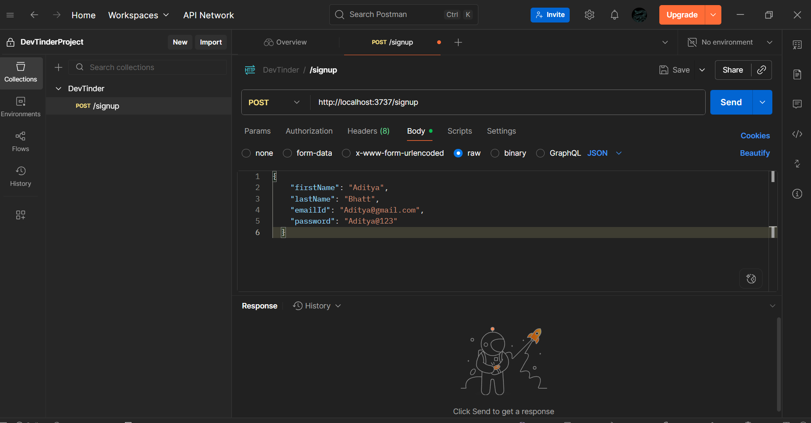

# 🌟 Lecture Notes: Node.js Season 2 – Episode 7

## 🚀 Diving into APIs with Express & Mongoose

---

## 📝 Key Learnings

### 1️⃣ Adding Users Dynamically with `POST:/signup`

* Go to **Postman** → request section → `Body` → select **raw** → choose **JSON** → add a JSON object.

👉 Example JSON request:

```json
{
  "firstName": "Aditya",
  "lastName": "Bhatt",
  "emailId": "Aditya@gmail.com",
  "password": "Aditya@123"
}
```



* By default, `req.body` in Express **cannot read JSON data**.
* Solution → Use middleware:

```js
app.use(express.json());  
```

This makes Express able to parse JSON body data for all APIs.

* Save incoming data to MongoDB using **Mongoose model**:

```js
app.post("/signup", async (req, res) => {
  console.log(req.body);
  const user = new User(req.body);

  try {
    await user.save(); // Mongoose functions return promises
    res.send("Data successfully saved!");
  } catch (err) {
    res.status(400).send("Error saving the user: " + err.message);
  }
});
```

✨ **Tip:** Always validate request data before saving.

---

### 2️⃣ Fetch User by Email – `GET:/getuserbyemail`

* Use **Mongoose method** `findOne()` to fetch a single user.
* Example:

```js
app.get("/getuserbyemail", async (req, res) => {
  try {
    const userEmail = req.body.emailId;
    const user = await User.findOne({ emailId: userEmail });
    res.send(user);
  } catch (err) {
    res.status(400).send("Error in fetching data");
  }
});
```


⚡ Note: If multiple users exist with the same email, `findOne()` returns the first match.

---

### 3️⃣ Fetch All Users – `GET:/feed`

* Use **Mongoose method** `find({})` to fetch all docs in the collection.
* Example:

```js
app.get('/feed', async (req, res) => {
  try {
    const users = await User.find({}); // Empty filter = fetch all docs
    res.send(users);
  } catch (err) {
    res.status(400).send("Something went wrong!");
  }
});
```


---

### 4️⃣ Delete a User – `DELETE:/user`

* Use **Mongoose method** `findByIdAndDelete()`.
* Example:

```js
app.delete('/user', async (req, res) => {
  try {
    const userId = req.body.userId;
    await User.findByIdAndDelete(userId);
    res.send("Successfully deleted a user!");
  } catch (err) {
    res.status(400).send("Problem in the Delete API!");
  }
});
```

---

### 5️⃣ Update a User – `PATCH:/user`

* Use **Mongoose method** `findByIdAndUpdate()`.
* Example:

```js
app.patch('/user', async (req, res) => {
  try {
    const userId = req.body.userId;
    const newData = req.body;

    const user = await User.findByIdAndUpdate(
      userId,
      newData,
      { returnDocument: 'before' } // options: 'before' or 'after'
    );

    console.log(user);
    res.send("Successfully updated a user!");
  } catch (err) {
    res.status(400).send("Error in updating the data!");
  }
});
```

💡 **About Updating Fields:**

* If new fields not defined in schema are sent → MongoDB ignores them.
* Example:

```json
{
  "userId": "68b7bfeb1878367e70c27313",
  "firstName": "Ayush",
  "lastName": "Bhatt",
  "newField": "ignoredField"
}
```

➡️ `newField` won’t be added to DB.

---

## 📊 API Workflow Diagram

```mermaid
flowchart TD
    A[🧑 User] -->|POST /signup| B[💻 Express Server]
    B -->|Parse JSON| C[⚙️ Middleware express.json()]
    C -->|Save| D[(🗄️ MongoDB Users Collection)]
    A -->|GET /getuserbyemail| B
    B -->|findOne()| D
    A -->|GET /feed| B
    B -->|find({})| D
    A -->|DELETE /user| B
    B -->|findByIdAndDelete()| D
    A -->|PATCH /user| B
    B -->|findByIdAndUpdate()| D
```

✨ **Mnemonic:**
👉 Think of APIs like a food delivery app:

* `POST` → placing an order 🍔
* `GET` → checking your order 📦
* `PATCH` → updating address 🏠
* `DELETE` → cancelling the order ❌

---
