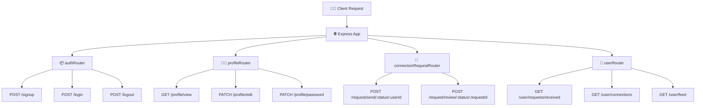

# 🌟 Lecture Notes: Node.js Season 2 – Lecture 11

## 🚀 Diving into APIs & Express Router

---

## 📝 Key Points

### 1. Why Express Router? 🤔

* Until now, we created APIs directly in `app.js`.
* That works fine for **small projects** with only a few APIs.
* But in real-world apps, we may have **100+ APIs** 😱.
* Keeping all of them in one file = **messy, unmanageable, painful**.
* **Solution → Use Express Router**:

  * Allows grouping APIs by **categories** (auth, profile, user, connections, etc.).
  * Each group lives in its own file → clean & modular.
  * Express automatically manages and connects them to `app.js`.

✨ **Extra Tip**:
Think of Express Router like 📂 *folders for your APIs*. Instead of dumping everything into one messy bag, you keep them neatly organized!

---

### 2. DevTinder APIs (Design 📝)

We grouped APIs into routers:

* **Auth Router**

  * `POST /signup`
  * `POST /login`
  * `POST /logout`

* **Profile Router**

  * `GET /profile/view`
  * `PATCH /profile/edit`
  * `PATCH /profile/password` (forgot password)

* **Connection Request Router**

  * `POST /request/send/:status/:userId`
  * `POST /request/review/:status/:requestId`

* **User Router**

  * `GET /user/requests/received`
  * `GET /user/connections`
  * `GET /user/feed` → fetches profiles of other users

👉 **Status values**: `ignored`, `interested`, `accepted`, `rejected`.

---

## 📊 Diagram: API Router Flow



✨ Extra Tip:
👉 Always design your APIs first (like this list/diagram) before coding. Saves confusion later!

---

## 🛠 Example: `authRouter.js`

```js
const express = require("express");
const { validateSignUpData } = require("../utils/validation");
const bcrypt = require("bcrypt");
const User = require("../models/user");

const authRouter = express.Router(); // ✅ router created

// authRouter.post(), get(), patch() work same as app.post(), etc.

authRouter.post("/signup", async (req, res) => {
  // 1️⃣ Validate data
  validateSignUpData(req);

  const { firstName, lastName, emailId, password } = req.body;

  // 2️⃣ Encrypt password before saving
  const passwordHash = await bcrypt.hash(password, 10);

  const user = new User({
    firstName,
    lastName,
    emailId,
    password: passwordHash
  });

  try {
    await user.save(); // mongoose saves user → returns a promise
    res.send("Data successfully saved!");
  } catch (err) {
    res.status(400).send("Error saving user: " + err.message);
  }
});
```

---

### 🔑 Login Flow (`/login`)

```js
authRouter.post("/login", async (req, res) => {
  try {
    // 1️⃣ Get email & password
    const { emailId, password } = req.body;

    // 2️⃣ Find user in DB
    const user = await User.findOne({ emailId: emailId });
    if (!user) throw new Error("Invalid credentials!");

    // 3️⃣ Compare passwords
    const isPasswordValid = user.validatePassword(password); // custom method
    if (!isPasswordValid) throw new Error("Invalid credentials!");

    // 4️⃣ Generate JWT & set cookie
    const token = await user.getJWT(); // schema method
    res.cookie("token", token, {
      expires: new Date(Date.now() + 8 * 3600000), // 8 hrs expiry
    });

    res.send("Login Successful!! 🎉");
  } catch (err) {
    res.status(400).send("ERROR: " + err.message);
  }
});
```

👉 **Mnemonic**: Login = "Check → Compare → Create Cookie" ✅

---

### 🔑 Logout Flow (`/logout`)

```js
authRouter.post("/logout", async (req, res) => {
  res
    .cookie("token", null, {
      expires: new Date(Date.now()), // immediately expire
    })
    .send("Logout successfully!");
});
```

💡 Cookie trick: Setting it to `null` with immediate expiry deletes it.

---

## 🏗 `app.js` with Routers

```js
const connectDB = require("./config/database");
const express = require("express");
const cookieParser = require("cookie-parser");

const app = express();

app.use(express.json()); // parse JSON body
app.use(cookieParser()); // parse cookies

// Import routers
const authRouter = require("../src/routes/authRouter");
const userRouter = require("../src/routes/userRouter");
const profileRouter = require("../src/routes/profileRouter");

// Mount routers
app.use("/", authRouter);
app.use("/", userRouter);
app.use("/", profileRouter);

// Flow: request --> middlewares (json, cookieParser) --> correct router
// Once a route matches & responds, express stops there ✅

connectDB()
  .then(() => {
    console.log("✅ Connected to DB");
    app.listen("3737", () => {
      console.log("🚀 Server started on port 3737");
    });
  })
  .catch((err) => {
    console.error("❌ Database connection failed!");
  });
```

---

## 📝 Profile Editing API

### Validation Function

```js
const validateEditProfileData = (req) => {
  const allowedEditFields = ["firstName", "lastName", "photoUrl", "about", "skills"];

  // Check: every field in request must be in allowed list
  const isEditAllowed = Object.keys(req.body).every((field) =>
    allowedEditFields.includes(field)
  );

  return isEditAllowed;
};
```

---

### PATCH `/profile/edit`

```js
profileRouter.patch('/profile/edit', userAuth, async (req, res) => {
  try {
    if (!validateEditProfileData(req)) {
      throw new Error("Invalid Edit Request!");
    }

    const loggedInUser = req.user; // from userAuth middleware

    // Update old user fields with new ones
    Object.keys(req.body).forEach(
      (key) => (loggedInUser[key] = req.body[key])
    );

    await loggedInUser.save();

    res.json({
      message: `${loggedInUser.firstName}, your profile updated successfully 🎉`,
      data: loggedInUser
    });

  } catch (err) {
    res.status(401).send("Error: " + err.message);
  }
});
```

✨ **Extra Explanation**:
`Object.keys(req.body).forEach(...)` → loops over keys from new data and updates them in the old user object before saving.

---

## 📷 Screenshots

👉 Add screenshots here for Postman requests and lecture slides:


---

# ✅ Summary

* **Express Router** = organizes APIs into groups.
* **Auth APIs** → signup, login, logout.
* **Profile APIs** → view, edit, change password.
* **User APIs** → requests, connections, feed.
* **Connection Request APIs** → send & review requests.
* Cookies store JWT for login/logout.
* Profile editing uses **field validation** to prevent unwanted updates.

✨ Mnemonic: **“Design → Group → Router → Connect → Code”**

---

