# 🌟 Lecture Notes: Authentication, JWT & Cookies (Node.js - Session 2, Episode 10)

## 📝 Key Concepts

### 🔑 What is Login/Authentication?

* Whenever a **user makes any API call**, the server first checks:

  * Is this a **valid user**? ✅ or ❌
* Example flow:

  1. User calls `POST /login`.
  2. Server checks credentials (email + password).
  3. If valid → User gets logged in, connection closes.
  4. Next API call (e.g., `POST /updateProfile`) → server **again validates user**.
  5. This process repeats for all requests.

👉 Authentication ensures **every request** is made by a valid logged-in user.

---

## 🍪 JWT + Cookies Theory

* User logs in with email + password.
* Server validates → generates a **JWT token** (unique per user).
* Server wraps JWT inside a **cookie** and sends it back.
* Browser **stores the cookie automatically** (default behavior).
* On every request:

  * Browser automatically attaches the cookie.
  * Server extracts JWT from the cookie.
  * Server validates JWT → if valid, request succeeds.

✨ This is how Facebook, Instagram, etc., validate every like/comment you make.

---

## 📊 Flow of Login with JWT + Cookies

```mermaid
sequenceDiagram
    participant U as 👤 User
    participant S as 🖥️ Server

    U->>S: POST /login (email, password)
    S->>S: Validate credentials
    alt Valid ✅
        S->>U: Set-Cookie: token=JWT
        Note right of S: Cookie wraps JWT
    else Invalid ❌
        S->>U: Error "Invalid credentials"
    end

    U->>S: GET /profile (Cookie sent automatically 🍪)
    S->>S: Validate JWT
    S->>U: Profile data ✅
```



---

## 📷 Screenshot Reference

* Example of cookie stored in Postman:

---

## ⏳ When Cookies Don’t Work

* Cookies can **expire** after a set time (e.g., 1h, 2d, etc.).
* If cookie is expired:

  * Expired cookie is still sent with request.
  * Server validates JWT → finds it expired.
  * Server responds → `"Please login again"`.

👉 If cookie never expires, the user stays logged in forever (until logout).
⚠️ But **never-expiring tokens are risky** (security issue).

📷 Flow with expired cookie:


---

## 🛠️ Implementing JWT + Cookies in Express

### 1️⃣ Login API

```js
app.post("/login", async (req, res) => {
   try {
     const { emailId, password } = req.body;

     const user = await User.findOne({ emailId });
     if (!user) throw new Error("Invalid credential!");

     const isPasswordValid = await bcrypt.compare(password, user.password);
     if (isPasswordValid) {
       // ✅ Create JWT token
       const token = await jwt.sign({ _id: user._id }, "DEV@Tinder&3737");

       // ✅ Create cookie and send back
       res.cookie("token", token, {
         expires: new Date(Date.now() + 8 * 3600000), // 8 hrs
       });

       res.send("Login Successful!!");
     } else {
       throw new Error("Invalid credentials!");
     }
   } catch (err) {
     res.status(400).send("ERROR: " + err.message);
   }
});
```

---

### 2️⃣ Profile API (Validating JWT from Cookie)

```js
app.get("/profile", async (req, res) => {
  try {
    const { token } = req.cookies;
    if (!token) throw new Error("Token is not valid!");

    // ✅ Validate token
    const decoded = await jwt.verify(token, "DEV@Tinder&3737");

    const user = await User.findById(decoded._id);
    if (!user) throw new Error("User not found!");

    res.send(user);
  } catch (err) {
    res.status(401).send("ERROR: " + err.message);
  }
});
```

---

## 🔒 Auth Middleware (userAuth)

Instead of repeating token-checking logic everywhere →
Create a **middleware** to verify users.

```js
const userAuth = async (req, res, next) => {
   try {
      const { token } = req.cookies;
      if (!token) throw new Error("Token invalid!");

      const decoded = await jwt.verify(token, "DEV@Tinder&3737");
      const user = await User.findById(decoded._id);

      if (!user) throw new Error("User not found!");

      req.user = user; // attach user to request
      next();
   } catch (err) {
      res.status(400).send("ERROR: " + err.message);
   }
};
```

✅ Usage:

```js
app.get("/profile", userAuth, async (req, res) => {
  res.send(req.user);
});
```

---

## 🕒 Expiry Settings

* **JWT Expiry**

```js
const token = jwt.sign({ _id: user._id }, "DEV@Tinder&3737", {
  expiresIn: "1d", // 1 day
});
```

* **Cookie Expiry**

```js
res.cookie("token", token, {
  expires: new Date(Date.now() + 8 * 3600000), // 8 hours
});
```

⚠️ Best practice: **Always expire tokens** (e.g., 30 days max).
Never-expiring tokens = 🚨 risky for security.

---

## 🧩 Schema Methods in Mongoose

Instead of writing JWT/password logic in routes →
Attach them as **helper methods** on the schema. Cleaner + reusable.

### Example: `getJWT`

```js
userSchema.methods.getJWT = async function () {
  const user = this;
  const token = await jwt.sign({ _id: user._id }, "DEV@Tinder&3737");
  return token;
};
```

### Example: `validatePassword`

```js
userSchema.methods.validatePassword = async function (passwordInput) {
  const user = this;
  return await bcrypt.compare(passwordInput, user.password);
};
```

✅ Now in `login` route:

```js
const isPasswordValid = await user.validatePassword(password);
if (isPasswordValid) {
   const token = await user.getJWT();
   res.cookie("token", token);
}
```

---

## 📚 Full Flow Diagram

```mermaid
sequenceDiagram
    participant U as 👤 User
    participant S as 🖥️ Server
    participant DB as 🗄️ Database

    U->>S: POST /login (email, pass)
    S->>DB: Find user by email
    DB-->>S: Return user
    S->>S: bcrypt.compare(pass, hash)
    alt Valid ✅
        S->>S: jwt.sign({_id}, secret)
        S->>U: Set-Cookie: token=JWT
    else Invalid ❌
        S->>U: Error "Invalid credentials"
    end

    U->>S: GET /profile (cookie sent 🍪)
    S->>S: jwt.verify(token, secret)
    S->>DB: Get user by _id
    DB-->>S: Return user
    S->>U: Profile data ✅
```



---

## ✨ Tips

* JWT = 📦 (Header + Payload + Signature).
* Cookie = 🍪 Wrapper around JWT.
* Always **expire tokens** → more secure.
* Use **middleware** to avoid repeating auth logic.
* Schema methods = cleaner, reusable helpers.

---

📷 Relevant lecture screenshots:


---

