# 🌟 Lecture Notes: Node.js Season 2 - Episode 2

## 🚀 DevTinder Project Planning

We are planning and designing our **DevTinder** project (a developer connection app). In this lecture, we discussed **HLD (High Level Design)** and **LLD (Low Level Design)**.

---

## 📝 Features we are going to build

1. 🆕 Create an account
2. 🔑 Login
3. 📝 Update your profile
4. 📰 Feed Page - Explore
5. 🤝 Send Connection Request
6. 💖 See our matches
7. 📩 See requests we’ve sent/received
8. ✏️ Update your profile

👉 These features basically cover **signup, login, profile management, explore feed, sending/receiving requests, and connections**.
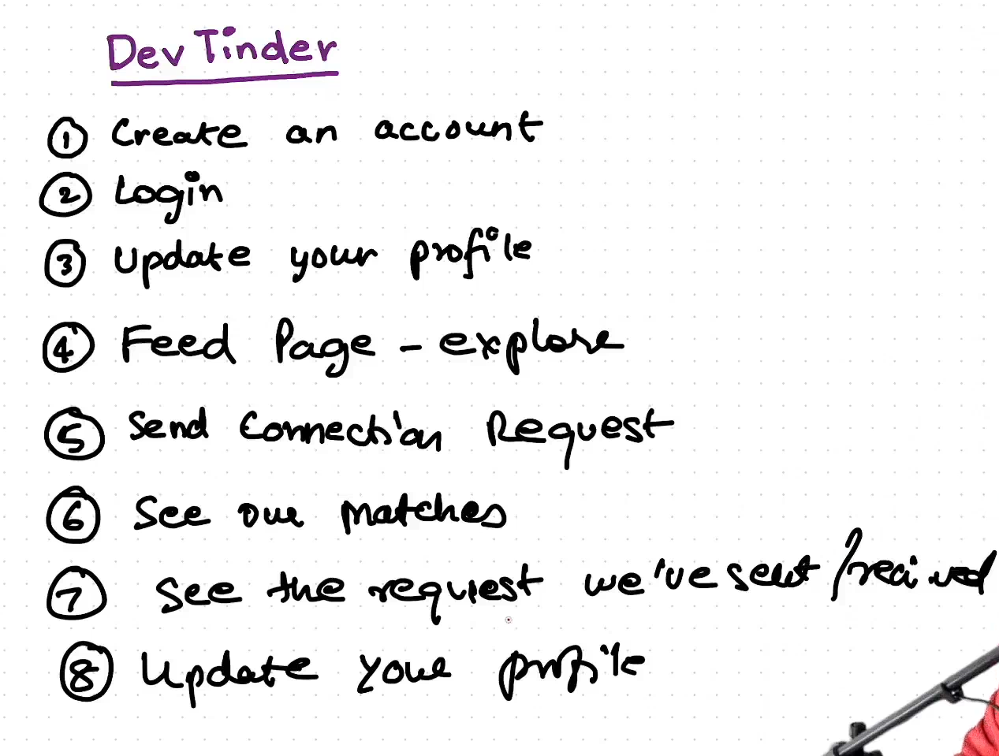 [Features](Notes.md)

---

## ⚙️ Tech Planning

We are going to build **2 microservices**:

* **Frontend (FE)** 🎨 → React
* **Backend (BE)** ⚡ → Node.js + Express.js + MongoDB

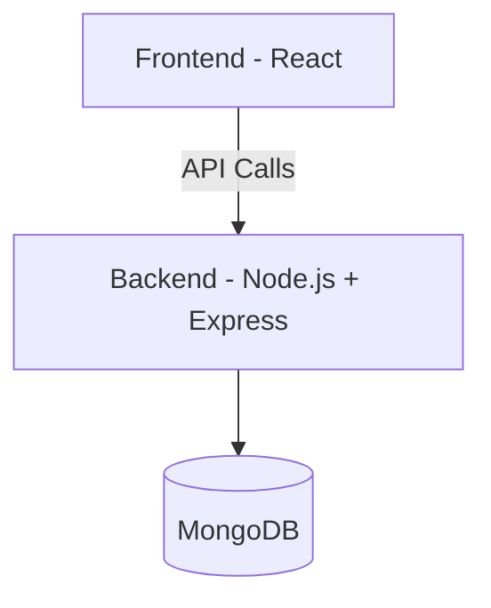
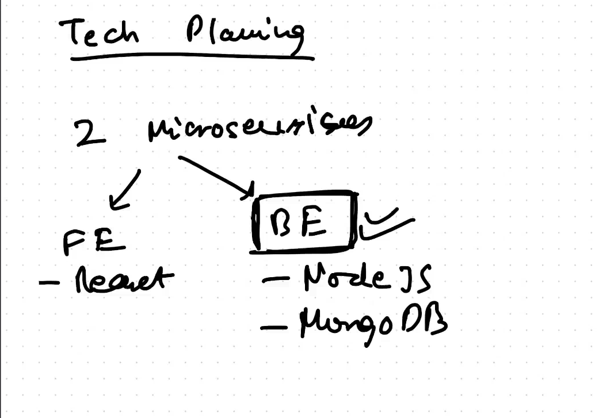

---

## 🛠️ Low Level Design (LLD)

👉 Good planning = Easy coding later. In LLD, **2 things are super important**:

1. **DB Design** (Where and how we store data)
2. **API Design** (How frontend & backend will talk)

---

### 📂 Database Design

We are using **MongoDB**. Let’s decide the **collections**:

#### 1️⃣ User Collection

Stores **all user profile data**:

* `firstName`
* `lastName`
* `email`
* `password`
* `age`
* `gender`

This collection powers **profile & feed page**.

#### 2️⃣ ConnectionRequest Collection

We can’t mix profile data with connection data. So, we create a separate collection:

* `fromUserId`
* `toUserId`
* `status` → can be:

  * `pending` ⏳
  * `accepted` ✅
  * `rejected` ❌
  * `ignored` 👀 (swipe left)

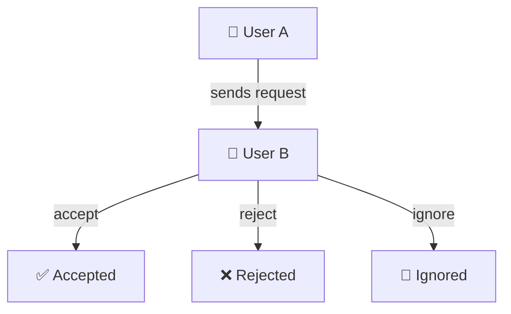
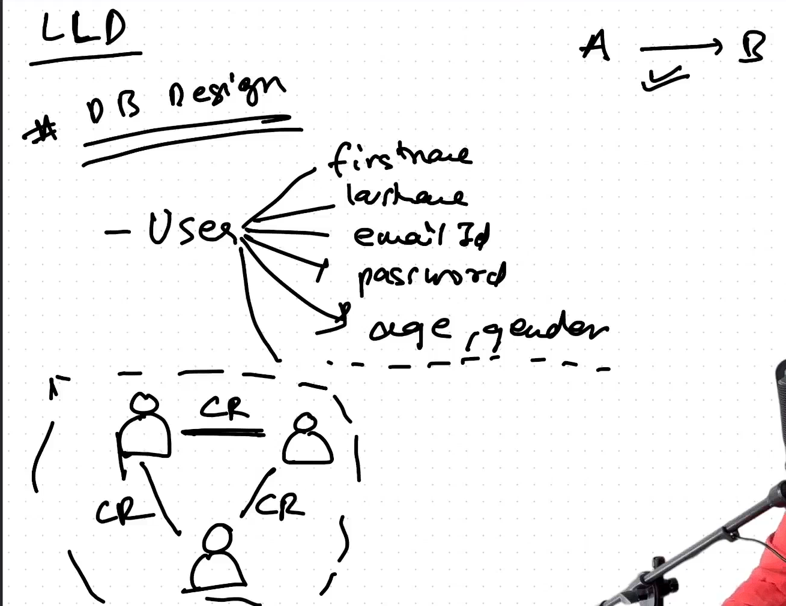

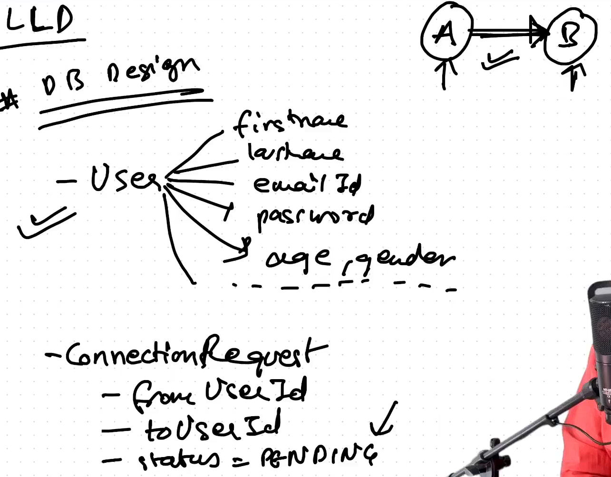

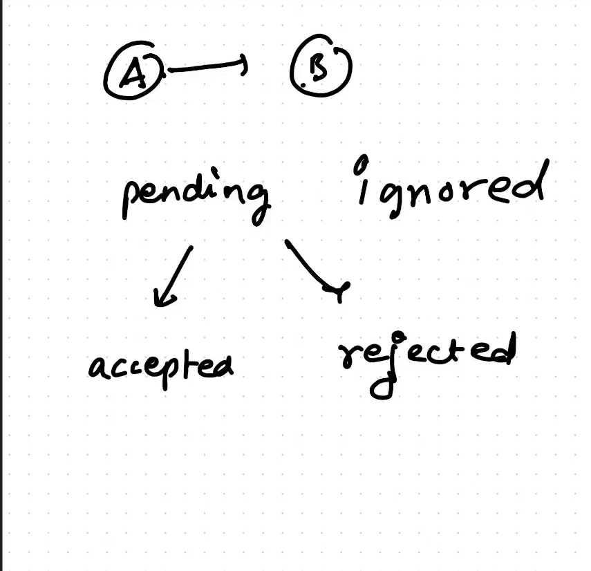

⚡ **Note:** Designing DB is not easy, especially for freshers. Every engineer has their own way. In real companies, **senior engineers design DB** because schema changes are costly. Remember: *"Data is the new oil"* ⛽

---

## 🌐 API Design

We will use **REST APIs** (CRUD operations).

### 🔑 Authentication

* **POST** `/signup`
* **POST** `/login`

### 👤 Profile

* **GET** `/profile` → Get profile data
* **POST** `/profile` → Create profile
* **PATCH** `/profile` → Update profile
* **DELETE** `/profile` → Delete profile

### 🤝 Connections

* **POST** `/sendRequest` → Send a request (interested/ignore)
* **POST** `/reviewRequest` → Accept/Reject a request
* **GET** `/requests` → See pending requests
* **GET** `/connections` → See accepted connections

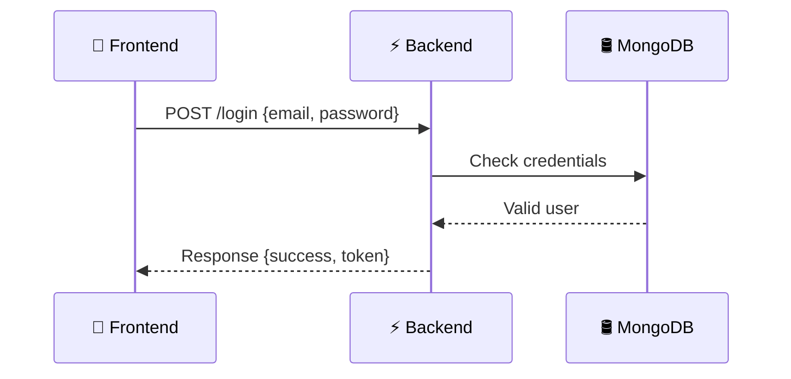

👉 Basically, these APIs = CRUD operations.

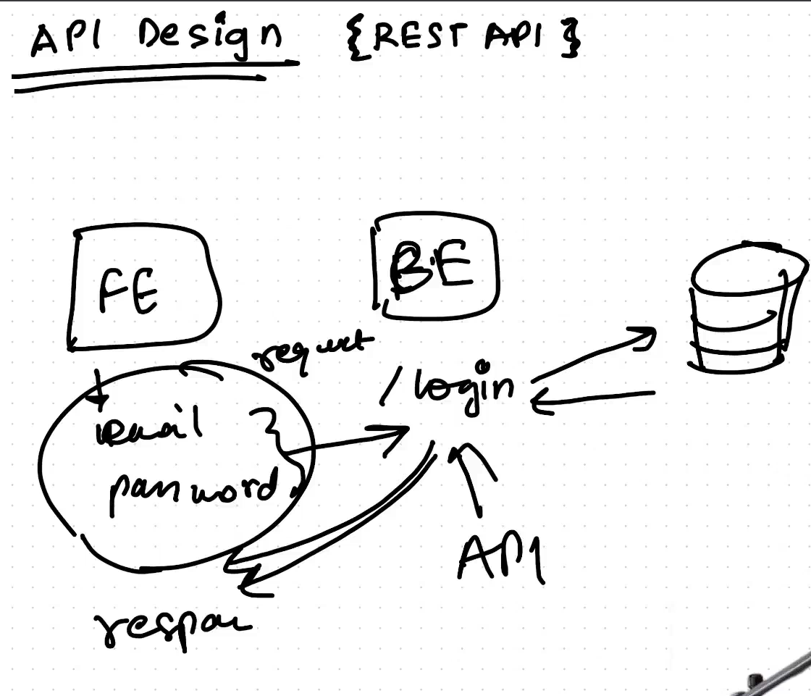

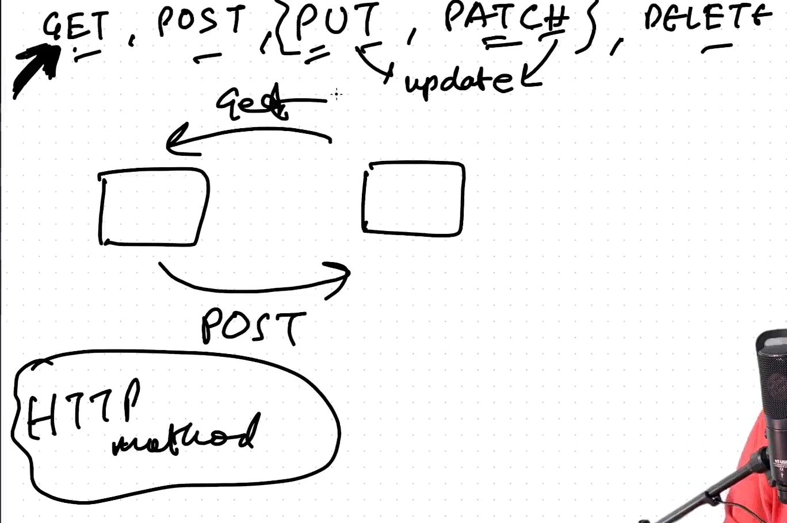

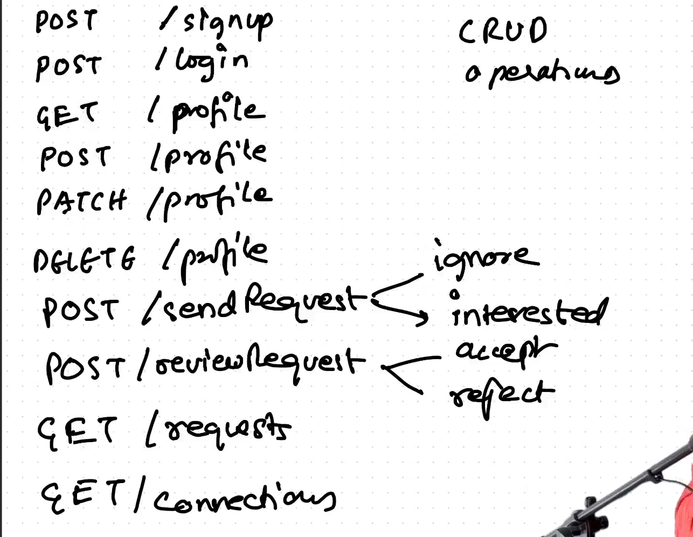

---

## ✨ Extra Tip

🔑 Remember: **Plan > Code**. If planning is solid (HLD + LLD), coding becomes very easy. In industry, planning is as important as coding.

---

# ✅ Final Takeaways

* Features: Signup, login, profile, requests, matches.
* Tech: React + Node.js + Express + MongoDB.
* DB: 2 collections → `Users`, `ConnectionRequests`.
* Status field is very important (`pending/accept/reject/ignore`).
* APIs follow **REST + CRUD**.
* Planning saves coding time.
