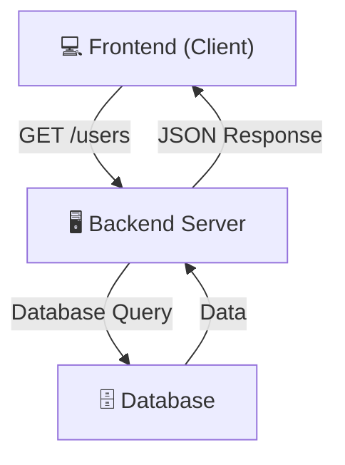
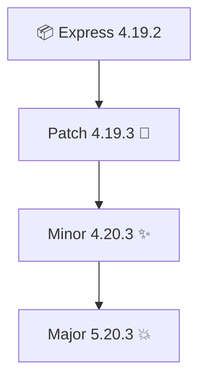
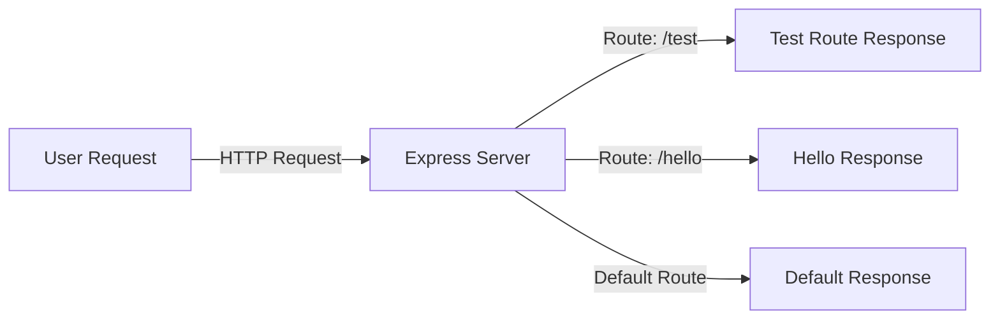

# 🌟 Lecture Notes: Node.js – Season 2 Episode 3  
## 🚀 Using Express.js to Create a Server  

---

## 📦 What is `node_modules`?  
- Whenever we install any package from **npm** (like `npm i express`), Node.js creates a special folder called **`node_modules`**.  
- It stores:  
  - ✅ The package we directly installed (e.g., Express).  
  - ✅ Other packages that our package depends on.  
  - ✅ And their dependencies too!  

👉 This whole chain is called **Transitive Dependencies**.  
They’re kept locally so we can use them while developing.  

🖼️ Lecture Screenshot:  


---

## 📜 What is `package.json`?  
- It’s a file that keeps information about the project such as:  
  - Name  
  - Version  
  - Author  
  - Dependencies (the packages our project directly depends on).  

**Example:**  
```json
"dependencies": {
   "express": "^4.19.2"
}
````

### 📌 About Versions (Semantic Versioning – SemVer)

* **4.19.2** → This means:

  * **4** → Major version (breaking changes 😱)
  * **19** → Minor version (new features, backward compatible ✨)
  * **2** → Patch version (bug fixes 🐛, very small updates)

### 📌 About the Symbols

* `^4.19.2` → **Caret symbol**: allows updates to **minor + patch versions** (4.x.x).
* `~4.19.2` → **Tilde symbol**: allows updates to **patch versions only** (4.19.x).
* `4.19.2` → No symbol: the version is fixed, no updates.

💡 So:

* Use `^` if you’re okay with features + bug fixes.
* Use `~` if you only want bug fixes.
* Use exact version if you want full stability.

🖼️ Lecture Screenshot (Versioning):


---

## 🔒 What is `package-lock.json`?

* It **locks** the exact versions of dependencies.
* Also includes info about **transitive dependencies**.
* Ensures that the project works the same way on every computer.

👉 Think of it like a **receipt** 🧾 of exactly what got installed.

---

## ⚡ What is Express.js?

* Express.js = **A Node.js framework** that helps us:

  * Create **HTTP servers** easily.
  * Build **APIs** quickly.
* It makes adding request handlers (routes) super easy compared to raw Node.js.

🖼️ Lecture Screenshot (Server Diagram):


---


# 🌐 API vs REST API – Learning Notes

## 🔹 What is an API?
- **API = Application Programming Interface**  
- A **set of rules** that allow two pieces of software to **communicate**.  
- APIs are **not limited to web** – they exist in:
  - 💻 Operating Systems (Windows API)
  - 📚 Programming Libraries (Java API)
  - 🗄️ Databases (SQL API)
  - 🌍 Web APIs (REST, GraphQL, SOAP, etc.)

👉 Think of an API as a **restaurant menu 🍽️**:  
- The **client** (you) orders from the menu (API).  
- The **kitchen** (server) prepares it.  
- The **waiter** (API call) delivers the food (response).  

---

## 🔹 What is a REST API?
- **REST = Representational State Transfer** → an **architecture style** for web APIs.  
- REST APIs use **HTTP methods**:  
  - 📖 `GET` → Fetch data  
  - ✍️ `POST` → Send new data  
  - 🛠️ `PUT` → Update existing data  
  - 🗑️ `DELETE` → Remove data  

### 📝 Example Endpoints
```

GET    /users        -> Get list of users
POST   /users        -> Create a new user
GET    /users/\:id    -> Get specific user
PUT    /users/\:id    -> Update a user
DELETE /users/\:id    -> Delete a user

````

---

## 🔄 How API Works (Client ↔ Server)


---


## 🛠️ Creating a Server with Express.js

1. Install express:

   ```bash
   npm install express
   ```
2. Create `app.js` and add server code.
3. Use `nodemon` for auto-restart on changes.
4. Update scripts in `package.json`:

   ```json
   "scripts": {
      "start": "node src/app.js",
      "dev": "nodemon src/app.js"
   }
   ```

---

## 👨‍💻 Example Code

```js
const express = require("express"); 
// Express is coming from node_modules

const app = express(); 
// Creates an instance of Express (your application object)

// 🚦 Order of routes matter in Express.js
// Express checks routes top-to-bottom

app.use("/route1", (req, res) => {
  res.send("You are on route1");
});

app.use("/route2", (req, res) => {
  res.send("You are on route2");
});

app.use("/", (req, res) => {
  // Will match "/" or any other route if above ones don’t match
  res.send("Hello from the server!");
});

app.listen(3737, () => {
  console.log("✅ Server is successfully listening on port 3737");
});
```

---

## 📊 Diagrams

### 🔑 Versioning (Major / Minor / Patch)



---

### 🌐 Server Listening Flow



---

## 🔑 Extra Notes

* **Dependencies**: Packages our project directly depends on.
* **Global install (`-g`)**: Installs the package globally on your machine so you can use it in any project. Example:

  ```bash
  npm install -g nodemon
  ```
* **Order of Routes**: Express matches routes **in the order they are defined**.

---

✨ **Quick Recap Mnemonic:**

* **M**ajor → **M**ay Break (💥)
* **M**inor → **M**ore Features (✨)
* **P**atch → **P**roblem Fixes (🐛)

---


