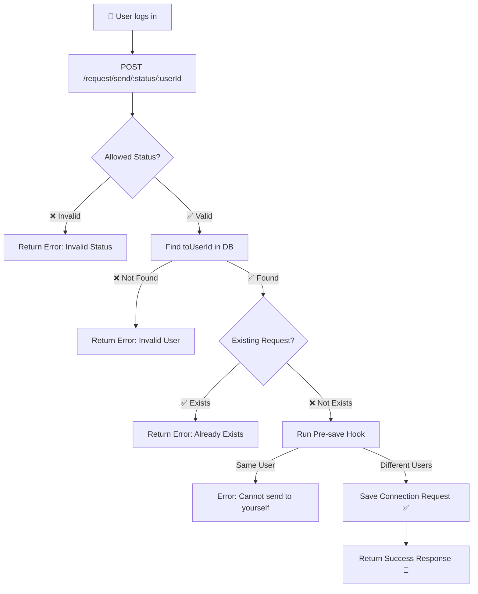

# 🌟 Lecture Notes: Season 2 – Lecture 11

## 🧩 Logical DB Query & Compound Indexes + Building Connection Request APIs

---

## 📝 Key Concepts

### 🔹 Why a Separate Schema for Connection Requests?

* We’re building a new set of APIs for **connection requests** (like friend requests).
* Since this feature has a **different functionality** than `userSchema`, we keep it in a **separate schema** (`connectionRequestSchema`).
* This keeps our database clean, modular, and easier to maintain.

---

### 🔹 Enum in Mongoose

* `enum` is used to **restrict values of a field** to a fixed set of options.
* Example: For request `status`, we only allow a few valid values.
* If someone tries to insert something else, MongoDB will throw an error.

👉 Example code for `status` with enum:

```js
status: {
  type: String,
  enum: {
    values: ["ignore", "interested", "accepted", "rejected"],
    message: `{VALUE} is incorrect status type`,
  }
}
```

✨ Tip: You can also use `enum` in `userSchema` (e.g., `gender` field).

---

## 🛠 ConnectionRequest Schema & Model

```js
const mongoose = require("mongoose");

const connectionRequestSchema = new mongoose.Schema({

    fromUserId: {
        type: mongoose.Schema.Types.ObjectId,  // ✅ Use ObjectId (not string)
        required: true,
    },
    toUserId: {
        type: mongoose.Schema.Types.ObjectId,
        required: true,
    },
    status: {
        type: String,
        required: true,
        enum: {
            values: ["ignore", "interested", "accepted", "rejected"],
            message: `{VALUE} is incorrect status type`,
        }
    }

}, { timestamps: true });

// 🛡️ Pre-save middleware to prevent sending requests to yourself
connectionRequestSchema.pre("save", function (next) {
    const connectionRequest = this;

    if (connectionRequest.fromUserId.equals(connectionRequest.toUserId)) {
        throw new Error("You cannot send a request to yourself!!");
    }

    next(); // ⚡ Always call next() or saving won’t continue
});

const ConnectionRequestModel = new mongoose.model(
    "connectionRequest",
    connectionRequestSchema
);

module.exports = ConnectionRequestModel;
```

---

## 🚀 API: `POST /request/send/:status/:userId`

👉 This API lets a user send a **connection request**.
👉 Flow of logic (with validations and corner cases):

```js
const express = require("express");
const userAuth = require("../middlewares/auth");
const User = require("../models/user");
const ConnectionRequestModel = require("../models/connectionRequest");

const requestRouter = express.Router();

requestRouter.post("/request/send/:status/:userId", userAuth, async (req, res) => {
    try {
        const fromUserId = req.user._id;     // Sender = logged in user
        const toUserId = req.params.userId;  // Receiver
        const status = req.params.status;

        // ✅ Only "ignore" or "interested" allowed while sending request
        const allowedStatus = ["ignore", "interested"];
        if (!allowedStatus.includes(status)) {
            return res.status(404).json({ message: "Invalid Status!!!" });
        }

        // ✅ Check if toUserId exists in DB
        const toUser = await User.findById(toUserId);
        if (!toUser) {
            return res.status(404).send("Invalid User!!");
        }

        // ✅ Prevent duplicate requests
        const existingConnectionRequest = await ConnectionRequestModel.findOne({
            $or: [
                { fromUserId, toUserId },
                { fromUserId: toUserId, toUserId: fromUserId },
            ]
        });

        if (existingConnectionRequest) {
            return res.status(404).send("Connection Request already exists!!");
        }

        // ✅ Create new connection request instance
        const connectionRequestInstance = new ConnectionRequestModel({
            fromUserId,
            toUserId,
            status
        });

        // ⚡ Pre-save hook will auto-check: no self-request allowed
        const data = await connectionRequestInstance.save();

        res.json({
            message: `${req.user.firstName} sent "${status}" status to: ${toUser.firstName}`,
            data: data
        });
    } catch (err) {
        res.status(400).send("ERROR : " + err.message);
    }
});

module.exports = requestRouter;
```

---

## 📊 Diagram – Flow of Sending a Request



✨ **Mnemonic**:
Think of the request flow as a **security guard checkpoint** 🛂:

* Status check ✅
* User exists ✅
* No duplicates ✅
* Not yourself ✅
* Finally saved 🎉

---


---

## ⚡ Key Takeaways

* Always use **`ObjectId` type** for user references (`fromUserId`, `toUserId`).
* Use **enum** for restricting values like `status`.
* Use **pre-save middleware** to add validation logic before saving.
* Handle **corner cases**: invalid status, user not found, duplicate requests, sending to self.
* `$or` queries in MongoDB help check both directions of a relationship.

---

