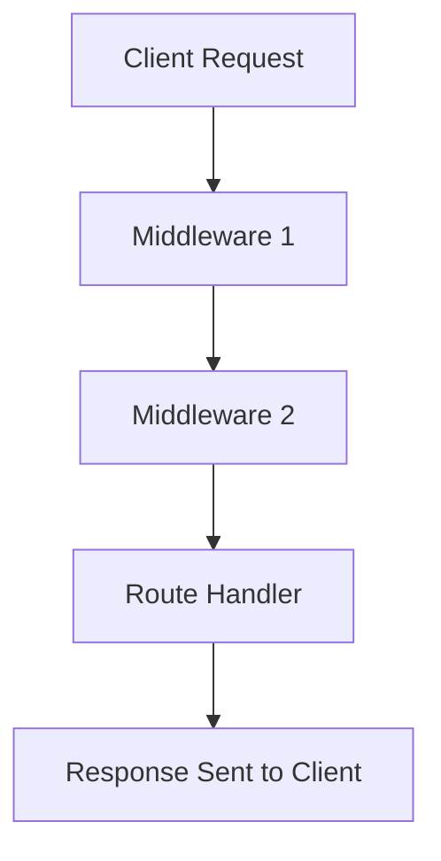
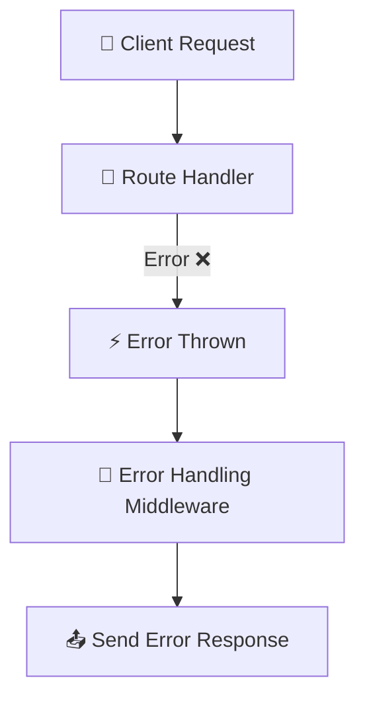

# 🌟Seasion 2 Episode 5 Lecture Notes: Express.js Middlewares & Error Handlers  

## 📝 Key Concepts  

### 🔹 What is happening in `app.use`?  
```js
app.use("/user", (req, res) => {
   console.log("handling the route user !!");
});
````

* Here, the **route is `/user`**.
* The **handler function** `(req, res)` is what processes the request.
* If you don’t call `res.send()` (or similar like `res.json()`, `res.end()`), Postman will **hang forever** ⏳ because the server never sends a response back.

---

### 🔹 Multiple Handlers in One Route

```js
app.use(
  "/user",
  (req, res, next) => {
    console.log("handling the route user 1!!");
    res.send("1st Response!!");
    next();
  },
  (req, res) => {
    console.log("handling the route user 2!!");
    res.send("2nd Response!!");
  }
);
```

👉 `next()` tells Express to go to the **next handler**.
⚠️ But **one route can send only one response**! If you try to send multiple responses, you’ll get an error.

---


# 📘 Express.js – Middleware vs Route Handler

## 🔹 Middleware in Express.js
- Middleware is a **function** in Express that runs **between the request and the response**.  
- It has access to:
  - `req` → Request object  
  - `res` → Response object  
  - `next()` → Function to pass control to the next middleware or route handler  
- Common uses:
  - ✅ Authentication & Authorization  
  - ✅ Request body parsing (`express.json()`)  
  - ✅ Logging requests  
  - ✅ Data validation  
  - ✅ Error handling  

### 📝 Example:
```js
app.use((req, res, next) => {
  console.log("Middleware executed");
  next(); // passes control to the next middleware/route
});
````

---

## 🔹 Route Handler in Express.js

* A **route handler** is the function that actually **sends the response** for a given route (URL + HTTP method).
* It’s the **end point** in the request–response cycle.

### 📝 Example:

```js
app.get("/user", (req, res) => {
  res.send("User data"); // Route handler sending response
});
```

## 🔄 Flow Diagram



---

## ✨ Key Difference

| Feature      | Middleware 🛠️                             | Route Handler 🎯              |
| ------------ | ------------------------------------------ | ----------------------------- |
| Purpose      | Process/transform request or handle errors | Send final response to client |
| Position     | Runs **before** the route handler          | Final step in cycle           |
| Control Flow | Calls `next()` to continue                 | Ends cycle with `res.send()`  |

---

✨ **Tip:** Think of middleware like **security checks at the airport**:

* Check 1 ✅ Passport
* Check 2 ✅ Security Scan
* Final Gate 🎟️ Boarding (response sent)

---

## 🔑 Why Middleware?

Middleware functions are used because:

* They **run before** the response is sent back.
* They can:

  * ✅ Check authentication
  * ✅ Validate request data
  * ✅ Log request info
  * ✅ Modify request/response objects
  * ✅ Stop the request (send error)
  * ✅ Pass control using `next()`

---

## 🧩 Example: Auth Middleware

```js
const userMiddleware = (req, res, next) => {
  const userToken = "@user";
  const userAuth = userToken === "@user";

  if (!userAuth) {
    res.status(401).send("User not recognized ❌");
  } else {
    next();
  }
};

app.get("/user/login", userMiddleware, (req, res) => {
  res.send("User signed in successfully ✅");
});
```

📌 Here, `userMiddleware` checks authentication.

* If invalid → sends **401 Unauthorized** ❌
* If valid → passes to next handler with `next()`

---

## 🚨 Error Handling in Express

Error handlers have **4 arguments**:

```js
app.use((err, req, res, next) => {
   console.log("Error handler triggered ⚡");
   res.status(500).send("Something went wrong!");
});
```

* Order matters → must be `(err, req, res, next)`.
* If you swap positions → Express won’t recognize it as an error handler.

---

### 🧩 Example: Throwing Errors

```js
app.get("/getUserData", (req, res) => {
   throw new Error("error is thrown");
   res.send("This will never run");
});
```

👉 Without error handler → server **crashes** or exposes error stack in Postman.

---

### 🧩 Example: Global Error Handler

```js
app.use((err, req, res, next) => {
   if (err) {
      res.status(401).send("Error occurred ❌");
   } else {
      next();
   }
});
```

---

### 🧩 Example: Try–Catch for Local Errors

```js
app.get("/getUserData", (req, res) => {
   try {
      throw new Error("error is thrown");
      res.send("Success");
   } catch (err) {
      res.status(401).send("Error in getUserData ❌");
   }
});
```

👉 `try...catch` is for **specific routes**.
👉 Global error handler (`app.use`) is for **catching unhandled errors**.

---

## 📊 Error Handling Flow



---

## 💡 Final Takeaways

* **Middleware** = functions that run between **request and response**.
* You can chain multiple middleware functions → use `next()`.
* Only **one response** per request.
* Error handling is done via:

  * Local `try...catch` 🧯
  * Global error handler middleware ⚡

✨ **Mnemonic:**
👉 Request → \[Checkpoints 🛂] → Handler → Response

---


