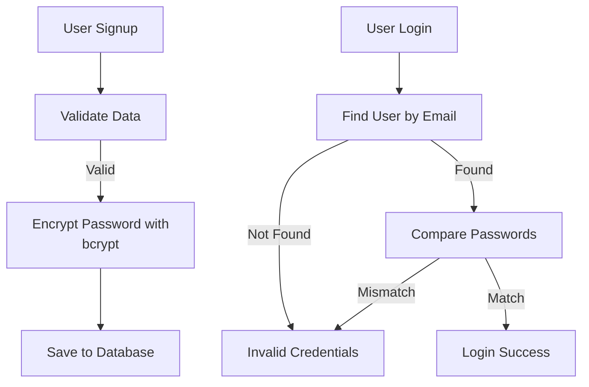

---

# 🌟 Lecture Notes: Node.js Season 2 – Episode 9

## 🔒 Encrypting Passwords

---

## 📝 Key Takeaways

* **Never trust `req.body`** 🚫
  Data from the client can be anything, so always **validate it first** before saving it to your DB.

* **Steps in a signup flow**:

  1. ✅ **Validation** → Check if data is valid.
  2. 🔒 **Encryption** → Hash the password before saving.
  3. 🗂️ **Save User** → Store safe data in DB.

* **Helper functions** keep code clean.

  * Create a `utils` (or `helpers`) folder inside `src/`.
  * Write validation functions like `validateSignUpData` inside `validation.js`.

---

## 📂 Validation Logic

Industry-standard way → use **validator.js** library.

```js
// validation.js
const validator = require("validator");

const validateSignUpData = (req) => {
  const { firstName, lastName, emailId, password } = req.body;

  if (!firstName || !lastName) {
    throw Error("Name is not Valid!");
  } else if (!validator.isEmail(emailId)) {
    throw Error("Email is not Valid!");
  } else if (!validator.isStrongPassword(password)) {
    throw Error("Please Enter a Strong password!");
  }
};

module.exports = { validateSignUpData };
```

👉 **Explanation:**

* `isEmail()` checks if email is in proper format.
* `isStrongPassword()` checks password strength (uppercase, lowercase, number, special character).

✨ **Tip:** Always validate at **API layer**, not just frontend. Backend is the last defense.

---

## 🚀 Signup API (Without Encryption)

```js
// POST /signup
app.post("/signup", async (req, res) => {
  // ✅ Step 1: Validate the data
  validateSignUpData(req);

  // ❌ Not safe yet: password stored as plain text
  const user = new User(req.body);

  try {
    await user.save(); // mongoose returns a Promise
    res.send("Data successfully saved!");
  } catch (err) {
    res.status(400).send("Error saving the user: " + err.message);
  }
});
```

⚠️ Problem → Password stored as **plain text**. Dangerous!

---

## 🔑 Encrypting the Password (Using bcrypt)

* Library: **bcrypt** (very popular for password hashing).
* It adds **salt + hash** → making it extremely hard to crack.

```js
// POST /signup with encryption
app.post("/signup", async (req, res) => {
  // ✅ Step 1: Validate the data
  validateSignUpData(req);

  const { firstName, lastName, emailId, password } = req.body;

  // ✅ Step 2: Encrypt password before saving
  const passwordHash = await bcrypt.hash(password, 10); 
  // "10" = salt rounds (higher = more secure, but slower)

  // ✅ Step 3: Save hashed password in DB
  const user = new User({
    firstName,
    lastName,
    emailId,
    password: passwordHash,
  });

  try {
    await user.save();
    res.send("Data successfully saved!");
  } catch (err) {
    res.status(400).send("Error saving the user: " + err.message);
  }
});
```

✨ **Tip:** Never store plain password. Always hash before saving.

---

## 🔐 Login Flow – Comparing Passwords

When user logs in:

1. Check if email exists in DB.
2. Compare entered password with **hashed password** in DB using `bcrypt.compare()`.

```js
// POST /login
app.post("/login", async (req, res) => {
  try {
    // Step 1: Extract login credentials
    const { emailId, password } = req.body;

    // Step 2: Find user by email
    const user = await User.findOne({ emailId: emailId });

    if (!user) {
      throw new Error("Invalid credentials!");
    }

    // Step 3: Compare entered password with DB hash
    const isPasswordValid = await bcrypt.compare(password, user.password);

    if (isPasswordValid) {
      res.send("Login Successful!!");
    } else {
      throw new Error("Invalid credentials!");
    }
  } catch (err) {
    res.status(400).send("ERROR: " + err.message);
  }
});
```

---

## 📊 Flow Diagram



---


---

## 💡 Extra Notes & Tips

* **Salt Rounds in bcrypt:**
  The number (e.g., `10`) means how many times the hashing process runs. Higher = more secure, but slower.

* **Why hashing, not encryption?**

  * **Encryption** = reversible with key 🔑
  * **Hashing** = one-way only 🚫 (can’t get original password back)
    → That’s why we use **hashing** for passwords.

* **Common Mistake:** Don’t store `bcrypt.compare` result directly. Always check with an `if` condition.

---

✅ That’s it for **Episode 9** — Now our signup/login system is **secure with validation + password hashing**.

---
