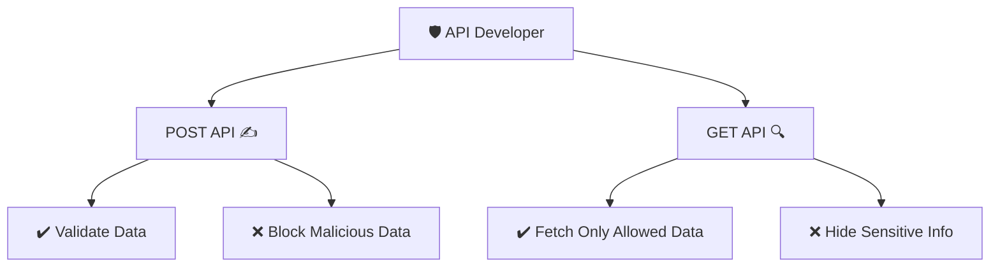

---

# 🌟 Lecture Notes: Ref, Populate & API Thought Process

## 📝 Key Points

* **Always think as a guard of DB 🛡️**
  👉 Whenever writing APIs, protect your DB from attackers, bad input, or unnecessary data exposure.

---

## 🔑 Thought Process of Writing APIs

### 1) POST APIs (Creating / Updating data) ✍️

* In POST APIs, the **consumer sends data to be stored in DB**.
* As a guard 🛡️:

  * Validate all input (attackers may send malicious data).
  * Ensure only **valid, safe data** gets saved.

✨ **Extra Tip:**
Think of POST API like **“Who can enter my house?”** 🏠 → Only people with ID & permission!

---

### 2) GET APIs (Fetching data) 🔍

* In GET APIs, the **consumer fetches data** from DB.
* As a guard 🛡️:

  * Only allow fetching **necessary and authorized data**.
  * Don’t expose sensitive data accidentally.

✨ **Extra Tip:**
Think of GET API like **“What’s visible through my window?”** 🪟 → Only show what is safe to share.

---

## 📊 Diagram: API Guard Concept



---

## 🚦 Implementing APIs

### 1) POST `/request/review/:status/:requestId`

👉 Used when user reviews a connection request (accept/reject).

```js
// Below API handles status : accepted & rejected
requestRouter.post(
  "/request/review/:status/:requestId",
  userAuth,
  async (req, res) => {
    try {
      // Aditya => Ayush
      // loggedInUser = toUserId
      // status = interested
      // requestId should be valid

      // Getting loggedInUser, status & requestId
      const loggedInUser = req.user; // provided by userAuth middleware
      const { status, requestId } = req.params;

      // Allowed status
      const allowedStatus = ["accepted", "rejected"];
      if (!allowedStatus.includes(status)) {
        return res.status(400).send("!invalid status");
      }

      // Validate if connection request exists with correct conditions
      const connectionRequest = await ConnectionRequestModel.findOne({
        _id: requestId,
        toUserId: loggedInUser._id,
        status: "interested",
      });

      if (!connectionRequest) {
        return res
          .status(400)
          .json({ message: "Connection request not found" });
      }

      // Update the status (accepted || rejected)
      connectionRequest.status = status;

      // Save to DB
      const data = await connectionRequest.save();

      res.json({
        message: "Connection Request " + status,
      });
    } catch (error) {
      res.status(401).send("ERROR : " + error.message);
    }
  }
);

module.exports = requestRouter;
```

✨ **Key Learnings:**

* ✅ Always check if status is allowed.
* ✅ Validate requestId + loggedInUser match.
* ✅ Save only after passing validations.

---

### 2) GET `/user/requests/received`

👉 Fetches **all pending requests** received by loggedInUser.
👉 Uses **populate** to fetch sender details safely.

```js
userRouter.get("/user/requests/received", userAuth, async (req, res) => {
  try {
    const loggedInUser = req.user;

    // Fetch only interested requests sent TO this user
    const connectionRequests = await ConnectionRequestModel.find({
      toUserId: loggedInUser._id,
      status: "interested",
    }).populate("fromUserId", USER_SAFE_DATA); 
    // 👆 only safe fields, not full user doc

    res.json({
      message: "Data fetched Successfully!",
      data: connectionRequests,
    });
  } catch (err) {
    res.status(400).send("ERROR : " + err.message);
  }
});
```

✨ **Why populate?**

* Instead of returning just `fromUserId` (ObjectId), it fetches **user details** from `User` collection.
* But only safe fields are fetched (e.g., name, not password).

---

### 3) GET `/user/connections`

👉 Fetches **all accepted connections** of loggedInUser.

```js
userRouter.get("/user/connections", userAuth, async (req, res) => {
  const loggedInUser = req.user;

  // Fetch requests where loggedInUser is either sender OR receiver
  const connectionRequests = await ConnectionRequestModel.find({
    $or: [
      { fromUserId: loggedInUser._id, status: "accepted" },
      { toUserId: loggedInUser._id, status: "accepted" }
    ],
  })
    .populate("fromUserId", USER_SAFE_DATA)
    .populate("toUserId", USER_SAFE_DATA);

  // Map to show only connected user (not self)
  const data = connectionRequests.map((row) => {
    if (row.fromUserId._id.toString() === loggedInUser._id.toString()) {
      return row.toUserId;
    }
    return row.fromUserId;
  });

  res.json({ data });
});

module.exports = userRouter;
```

---

## 🧩 Mongoose Schema with `ref`

```js
const mongoose = require("mongoose");

const connectionRequestSchema = new mongoose.Schema({
  fromUserId: {
    type: mongoose.Schema.Types.ObjectId,
    ref: "User", // helps populate User details
    required: true,
  },
  toUserId: {
    type: mongoose.Schema.Types.ObjectId,
    ref: "User",
    required: true,
  },
  status: {
    type: String,
    required: true,
    enum: {
      values: ["ignore", "interested", "accepted", "rejected"],
      message: `{VALUE} is incorrect status type`,
    },
  },
}, { timestamps: true });

// Prevent sending request to self
connectionRequestSchema.pre("save", function (next) {
  const connectionRequest = this;
  if (connectionRequest.fromUserId.equals(connectionRequest.toUserId)) {
    throw new Error("You Cannot send request to yourself!!");
  }
  next(); // mandatory
});

const ConnectionRequestModel = new mongoose.model(
  "connectionRequest",
  connectionRequestSchema
);

module.exports = ConnectionRequestModel;
```

---

## 📸 Screenshots


(Add your lecture board/Postman screenshots here)

---

## 🎯 Final Takeaways

* **POST APIs:** Validate before saving 🚫
* **GET APIs:** Fetch only safe, needed data 🔑
* **Populate:** Use to join user details but keep it minimal 🔍
* **Guard of DB mindset:** Always ask → *“Am I protecting my DB?”* 🛡️

---

