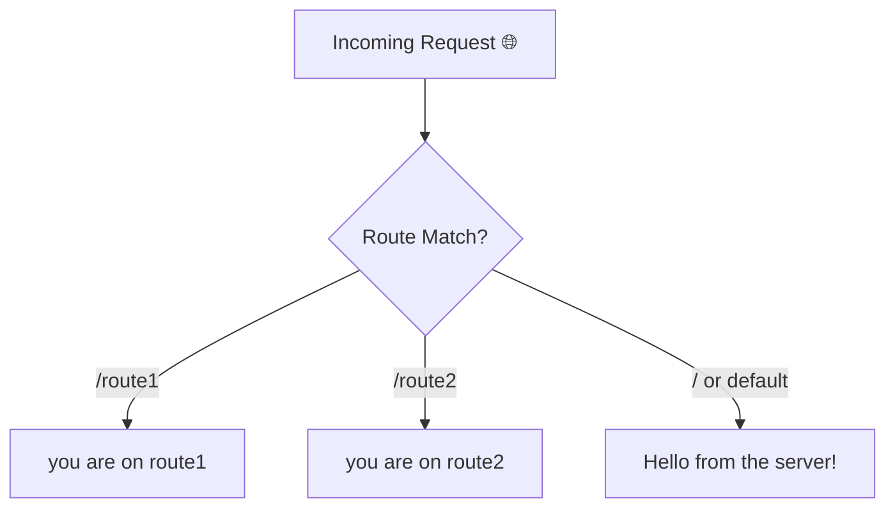

# 🌟 Lecture Notes: Node.js – Season 2 Episode 4 
## 🚀 Routing & Request_Handlers  


## 🌐 Playing with Routes in Express

### Example Code

```js
const express = require("express");
const app = express();

app.use("/route1", (req, res) => {
  res.send("you are on route1");
});

app.use("/route2", (req, res) => {
  res.send("you are on route2");
});

app.use("/", (req, res) => {
  res.send("Hello from the server!");
});

app.listen(3737, () => {
  console.log("Server is running on port 3737 🚀");
});
```

### 🎯 Key Points

* Order of routes **matters a lot** ⚠️.
* `/hello`, `/`, `/hello/2`, `/xyz` → each can have different handlers.

---

## 📬 Postman Setup

* Install **Postman App**.
* Create a **workspace/collection**.
* Test API calls (GET, POST, PATCH, DELETE).

---

## 🛠️ Handling HTTP Methods

```js
app.get("/users", (req, res) => {
  res.send("GET request - fetch users");
});

app.post("/users", (req, res) => {
  res.send("POST request - create user");
});

app.patch("/users/:id", (req, res) => {
  res.send(`PATCH request - update user with id ${req.params.id}`);
});

app.delete("/users/:id", (req, res) => {
  res.send(`DELETE request - delete user with id ${req.params.id}`);
});
```

---

## 🔀 Exploring Routing Patterns

* `?` → Optional

  ```js
  app.get("/ab?cd", (req, res) => res.send("Matched /acd or /abcd"));
  ```

* `+` → One or more

  ```js
  app.get("/ab+cd", (req, res) => res.send("Matched abcd, abbcd, abbbcd..."));
  ```

* `*` → Wildcard

  ```js
  app.get("/ab*cd", (req, res) => res.send("Matched abANYTHINGcd"));
  ```

* `()` → Grouping

  ```js
  app.get("/a(bc)?d", (req, res) => res.send("Matched /ad or /abcd"));
  ```

* **Regex Routes**

  ```js
  app.get(/.*fly$/, (req, res) => res.send("Matched words ending with 'fly'"));
  ```

---

## 🔎 Query Params & Dynamic Routes

* **Query Params**

  ```
  /users?page=1&limit=10
  ```

  ```js
  app.get("/users", (req, res) => {
    const { page, limit } = req.query;
    res.send(`Page = ${page}, Limit = ${limit}`);
  });
  ```

* **Dynamic Params**

  ```js
  app.get("/users/:id", (req, res) => {
    res.send(`User ID: ${req.params.id}`);
  });
  ```

---

## 📊 Route Flow Diagram



---

## 💡 Key Takeaways

* 🛣️ **Order of routes matters**.
* 🧩 Regex and wildcards make routes powerful.
* 🛠️ Always test APIs on Postman.
* 📂 Use `.gitignore` to keep repos clean.
* ⚡ Perseverance: keep experimenting with routes and methods.

---


