# 🌟 Lecture Notes: Software Development Life Cycle (SDLC) & Monolith vs Microservices

---

## 📌 Part 1: Software Development Life Cycle (SDLC)

### 📖 Waterfall Model

The **Waterfall Model** is one of the oldest models in SDLC. It’s a step-by-step (linear) process where one phase must finish before moving to the next.

**Phases & Roles:**

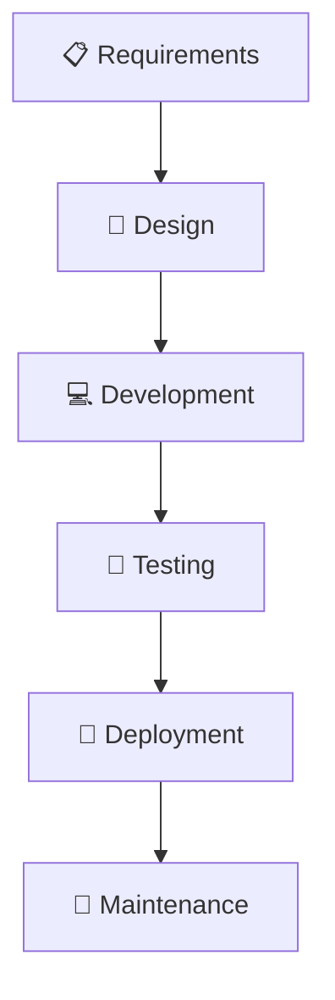

* **Requirements** → handled by **PM & Designer**
* **Design** → done by **Senior Engineer / Engineering Manager**
* **Development** → built by **SDE1, SDE2**
* **Testing** → verified by **SDET (QA Engineers)**
* **Deployment** → managed by **DevOps / Release Engineers**
* **Maintenance** → ongoing bug fixes + improvements

✨ **Tip:** Think of it like a waterfall ⛰️ — once water falls down, it can’t go back up easily. Similarly, in this model, going back to fix earlier stages is expensive.

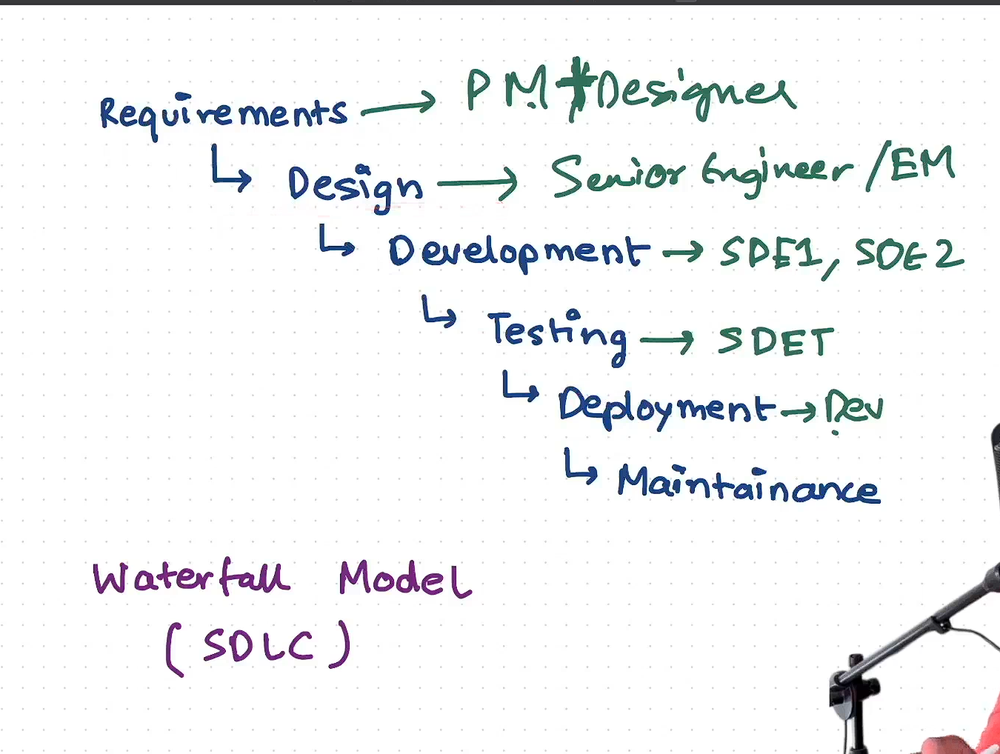
---

## 📌 Part 2: Monolith vs Microservices Architecture
---

## 🏛️ Monolithic Architecture

* All components (UI, business logic, database) are **tightly coupled** in a single codebase.
* Easier to develop initially but harder to scale.

### ✅ Pros

* Simple to develop & deploy.
* Easier debugging (single codebase).

### ❌ Cons

* Scaling requires scaling the whole app.
* Any small change requires redeploying the entire system.
* Harder to adopt new technologies.

### 📊 Monolith Diagram

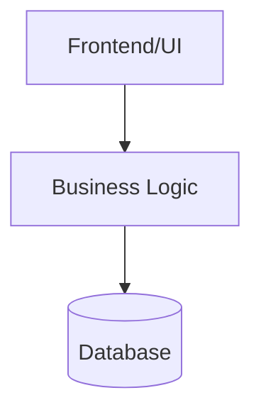

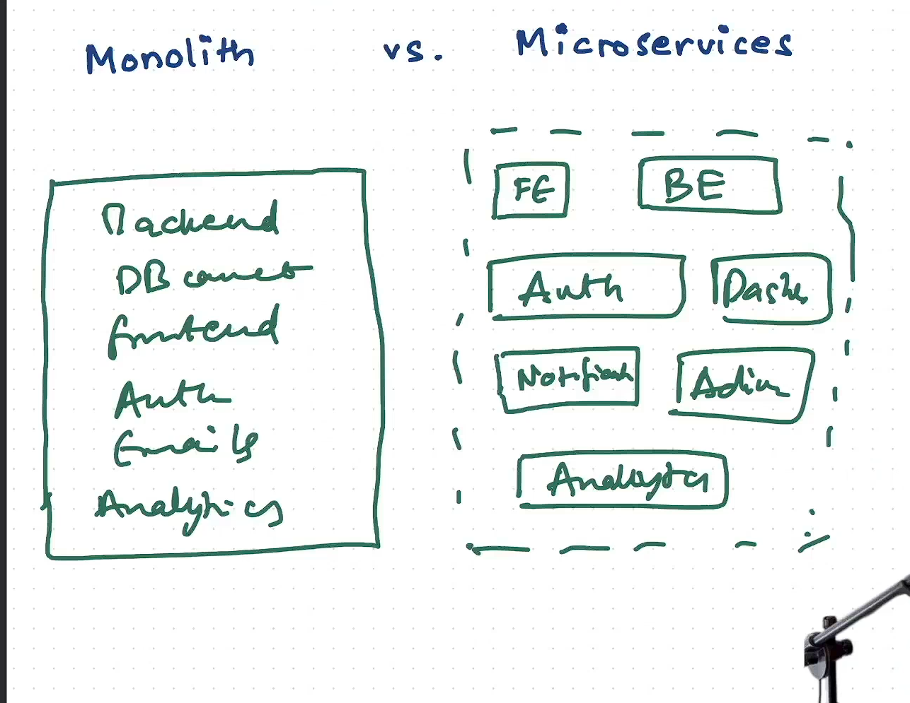

---

## 🧩 Microservices Architecture

* Application is broken into **small independent services** (Auth, Notifications, Analytics, Dashboard, etc.).
* Each service can be **developed, deployed, and scaled independently**.

### ✅ Pros

* Independent scaling.
* Technology flexibility.
* Faster development for large teams.

### ❌ Cons

* More complex to manage.
* Requires DevOps, CI/CD, monitoring.
* Higher communication overhead.

### 📊 Microservices Diagram

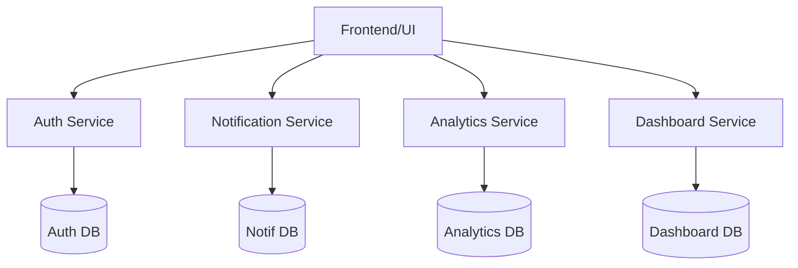

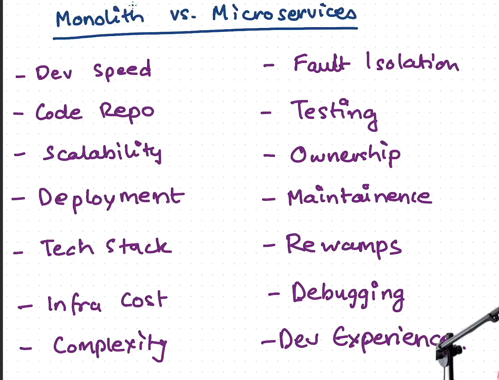

---

## ⚖️ Monolith vs Microservices

| Feature         | Monolithic 🏢 | Microservices 🧩        |
| --------------- | ------------- | ----------------------- |
| Codebase        | Single        | Multiple small services |
| Deployment      | One unit      | Independent services    |
| Scalability     | Entire app    | Service-wise            |
| Technology      | One stack     | Mix allowed             |
| Fault Isolation | Low           | High                    |
| Best for        | Small apps    | Large, complex apps     |

### 📊 Side-by-Side Comparison Diagram

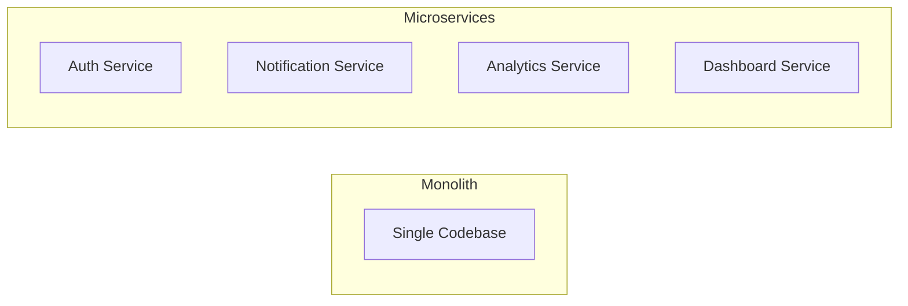
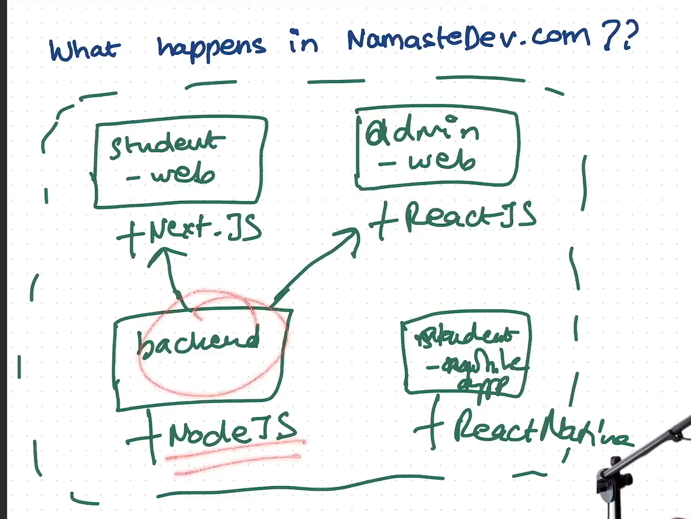

---

## 📌 Part 3: Monolith vs Microservices (Detailed Comparison)

| Feature ⚡                | Monolith 🏢                                                        | Microservices 🧩                                                                                                                                   |
| ------------------------ | ------------------------------------------------------------------ | -------------------------------------------------------------------------------------------------------------------------------------------------- |
| **Development Speed** 🚀 | Slower → single repo, merge conflicts when many devs work together | Faster → teams can work on independent services                                                                                                    |
| **Scalability** 📈       | Hard → must scale whole app even if only one part needs it         | Easy → scale only the needed service                                                                                                               |
| **Deployment** ⚙️        | Whole app redeployed for any change                                | Deploy only changed service  ❗ Problem: version mismatch between frontend & backend  ✅ Solution: **API versioning + backward compatibility** |
| **Tech Stack** 💻        | Stuck with one tech stack                                          | Can mix (e.g., Auth in Go, Dashboard in Node.js, Analytics in Python)                                                                              |
| **Infra Cost** 💰        | Lower (single infra)                                               | Higher (multiple services, load balancers, monitoring needed)                                                                                      |
| **Complexity** 🔀        | For small apps → less complex  For large apps → very messy      | For big apps → less complex (modular)  For small apps → adds unnecessary complexity                                                             |
| **Fault Isolation** ❌    | One bug can crash the whole system                                 | Only that microservice fails, rest keep working                                                                                                    |
| **Testing** 🧪           | Easier for end-to-end tests                                        | Harder → need service integration tests                                                                                                            |
| **Ownership** 👨‍💻      | Centralized                                                        | Each team owns one microservice                                                                                                                    |
| **Maintenance** 🛠️      | Tough for large projects                                           | Easier → modular updates                                                                                                                           |
| **Reworks / Revamps** 🔄 | Hard to refactor big code                                          | Easy → change/update only the service needed                                                                                                       |
| **Debugging** 🐞         | Hard → logs mixed together                                         | Easier (if proper monitoring & tracing set up)                                                                                                     |
| **Dev Experience** 🎯    | Often smoother for small teams                                     | Great for big orgs, but requires tooling & DevOps setup                                                                                            |

---

## 📌 Part 4: Real World Example 🌍

### Example: **NamasteDev.com**

* **Student Web App** → Next.js
* **Admin Web App** → React.js
* **Mobile App** → React Native
* **Backend** → Node.js

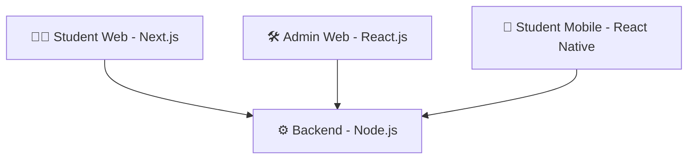
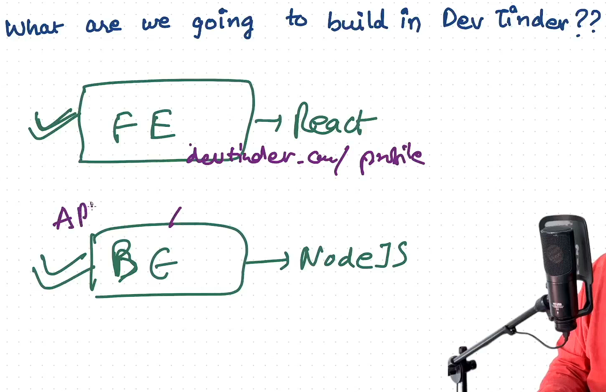

### Example: **DevTinder Project** ❤️

* **Frontend (FE)** → React
* **Backend (BE)** → Node.js + APIs

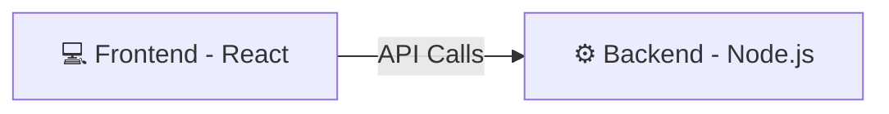

---

## ✨ Final Thoughts

* **Monolith** is good for **small projects/startups** 🐣
* **Microservices** shine in **large-scale apps** with many teams 🏢
* Always pick architecture based on **team size, project size, and scalability needs** 💡

---

