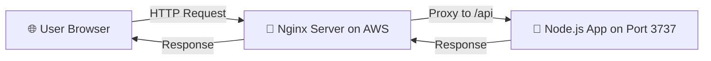
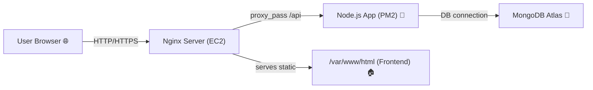

# 🌐 Node.js Season 3 Episode 2

## 🚀 Nginx & Backend Node App Deployment

---

## 🧭 Overview

In this lecture, we learned **how to deploy a Node.js backend application** on an AWS EC2 instance using **Nginx as a reverse proxy** and **PM2 as a process manager**.
This helps us keep our backend running continuously in the background and makes our deployment more professional 🌟.

---

## ⚙️ Step-by-Step Process

### 🧩 1. MongoDB Configuration

* Go to **MongoDB Atlas** → *Database Access tab* → **Change your password**.
* Then open the **Network Access tab** → Click **“Add IP Address”** → Add your **AWS EC2 instance’s Public IPv4 address**.

> 💡 This allows your Node.js app (running in AWS) to connect to the MongoDB database.

---

### 💻 2. Connect to AWS EC2 Server

```bash
ssh -i "devTinder-secret.pem" ubuntu@ec2-43-204-96-49.ap-south-1.compute.amazonaws.com
```

* Once connected, clone your backend repository:

```bash
git clone <repo-url>
```

* Move inside the project:

```bash
cd <repo-folder>
npm install
```

* You can test your backend by running:

```bash
npm start
```

> ⚠️ It will start, but **won’t connect to MongoDB** unless the EC2 IP is whitelisted on MongoDB Atlas.

---

### 🔄 3. Keep Node.js Running Forever with PM2

> PM2 is an advanced process manager for Node.js that ensures your app keeps running even if the terminal is closed.

Install PM2 globally:

```bash
npm install pm2 -g
```

Start your app with PM2:

```bash
pm2 start npm --name "devTinder-backend" -- start
```

Useful PM2 Commands:

```bash
pm2 logs                 # View logs  
pm2 list                 # Show all processes  
pm2 stop <name>          # Stop specific process  
pm2 delete <name>        # Delete process  
pm2 flush <name>         # Clear logs
```

> ✨ **Tip:** PM2 restarts your app automatically if it crashes.

---

### 🌍 4. Understanding Frontend & Backend URLs

Currently:

```
Frontend = http://43.204.96.49/
Backend  = http://43.204.96.49:3737/
```

But this setup isn’t ideal — it’s better to **use a domain name** and **avoid ports** in URLs.

We want:

```
Frontend = devtinder.com
Backend  = devtinder.com/api
```

So we’ll **map** our backend port (`:3737`) to the `/api` path using **Nginx**.
This is called **reverse proxying**.

---

## 🌉 What is a Reverse Proxy?

Nginx acts like a “middleman” — it receives requests from users and passes them to your backend.



✨ **Extra Tip:**
👉 Think of Nginx as a receptionist — users talk to it, and it forwards the request to your Node.js backend running inside.

---

## ⚙️ 5. Configure Nginx (Reverse Proxy Setup)

Open Nginx configuration file:

```bash
sudo nano /etc/nginx/sites-available/default
```

Find the line:

```
server_name _;
```

Replace it with your **domain** or **public IP**:

```
server_name 13.60.59.187;
```

Now, add this **location block** below:

```nginx
location /api/ {
    proxy_pass http://localhost:3737/;  # Node app running on port 3737
    proxy_http_version 1.1;
    proxy_set_header Upgrade $http_upgrade;
    proxy_set_header Connection 'upgrade';
    proxy_set_header Host $host;
    proxy_cache_bypass $http_upgrade;
}
```

Restart Nginx:

```bash
sudo systemctl restart nginx
```

> ✅ If you now go to `http://13.60.59.187/api`, and see **“Cannot GET /”**, it means your proxy mapping is working perfectly.

---

## 🔗 6. Fix API URL in Frontend

Now, in your **frontend code**, change the `BASE_URL` to:

```js
const BASE_URL = "/api";
```

> Because now all backend APIs will be accessible through `/api` route via Nginx.

Push your latest frontend code to GitHub, then pull it in your AWS instance:

```bash
git pull
```

---

## 🧱 7. Redeploy Updated Frontend

Rebuild your frontend:

```bash
npm run build
```

Then copy build files to Nginx’s HTML directory:

```bash
sudo scp -r dist/* /var/www/html/
```

Now your **frontend and backend** should both work properly through your domain or IP! 🎉

---

## 💡 Final Tips

* Always verify **Node.js** and **npm** versions on both local and server environments for compatibility.
* If something breaks, check logs:

  * PM2 logs for backend errors.
  * Nginx logs at `/var/log/nginx/error.log`

---

## 🧾 Quick Summary

### 🧠 Deployment Checklist

| Step | Task                  | Command / Action                          |
| ---- | --------------------- | ----------------------------------------- |
| 1️⃣  | Signup & Launch EC2   | AWS Console                               |
| 2️⃣  | Connect to Instance   | `ssh -i "key.pem" ubuntu@<IP>`            |
| 3️⃣  | Install Node.js       | `sudo apt install nodejs`                 |
| 4️⃣  | Clone Repo            | `git clone <repo>`                        |
| 5️⃣  | Install Dependencies  | `npm install`                             |
| 6️⃣  | Build Frontend        | `npm run build`                           |
| 7️⃣  | Install & Setup Nginx | `sudo apt install nginx`                  |
| 8️⃣  | Deploy Frontend       | `sudo scp -r dist/* /var/www/html/`       |
| 9️⃣  | Install PM2           | `npm install pm2 -g`                      |
| 🔟   | Run Backend with PM2  | `pm2 start npm --name "backend" -- start` |
| 🧩   | Configure Nginx Proxy | `/etc/nginx/sites-available/default`      |
| ✅    | Restart Nginx         | `sudo systemctl restart nginx`            |

---

## 🌍 Final Nginx Configuration Example

```nginx
server_name 43.204.96.49;

location /api/ {
    proxy_pass http://localhost:7777/;  # Pass the request to Node.js app
    proxy_http_version 1.1;
    proxy_set_header Upgrade $http_upgrade;
    proxy_set_header Connection 'upgrade';
    proxy_set_header Host $host;
    proxy_cache_bypass $http_upgrade;
}
```

> 🧠 Remember: `/api` acts as a **path alias** for your backend port.

---

## 🎨 Deployment Architecture



✨ **Easy Way to Remember:**

> Nginx serves frontend files 🏠 and redirects API calls to backend 🚀 which connects to MongoDB 🧩.

---

## 🧠 Recap

✅ **Frontend** → deployed to Nginx’s `/var/www/html`
✅ **Backend** → running via PM2 on Node.js port (3737/7777)
✅ **Nginx Proxy** → maps `/api` → backend port
✅ **MongoDB** → connected via EC2 public IP access
✅ **Smooth Deployment Workflow** achieved 🎯

---


✨ **Extra Reminder:**

> “If your app runs locally but not on AWS, always check — IP whitelisting, PM2 status, and Nginx config!”

---
